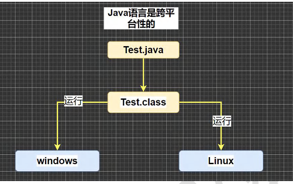
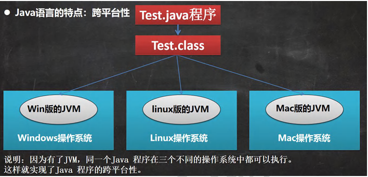
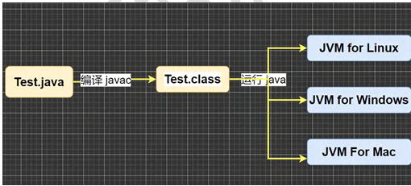
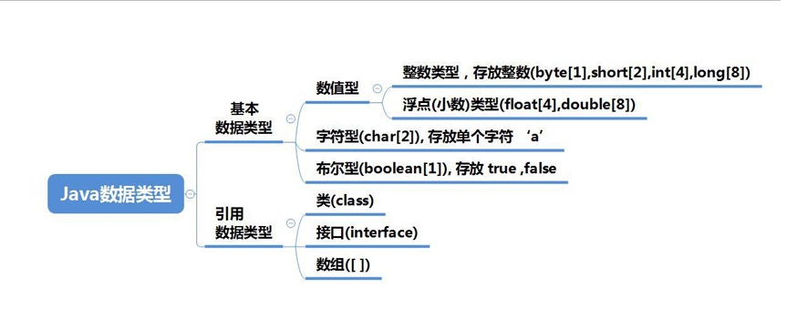
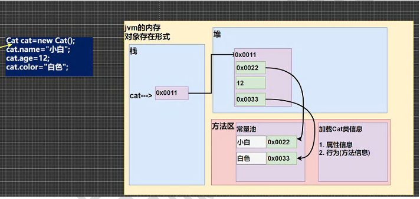

# Java概述

### Java技术体系平台

#### Java SE(Java Standard Edition)标准版

> 支持面向桌面级应用（如Windows下的应用程序）的Java平台，提供了完整的Java核心API，此版本一起称为 J2SE	

#### Java EE（Java Enterprise Edition）企业版

> 是为了开发企业环境下的应用程序提供的一套解决方案。该技术体系中包含的技术如：Servlet、Jsp等，主要针对于Web应用程序开发。版本以前称为J2EE

#### Jave ME(Java Micro Edition)小型版

> 支持Java程序运行在移动终端（手机、PDA）上的平台，对Java API 有所精简，并加入了针对移动端终端的支持，此版本以前成为 J2ME 

### Java重要特点

1. Java 语言是面向对的  `(oop)`;
2. Java 语言是<b>健壮</b>的。<b>Java</b> 的强类型机制、异常处理、垃圾的自动手机等是 Java 程序健壮的重要保证;
3. Java 语言是<b>跨平台性的</b>,[即:一个编译好的 .class 文件可以在多个系统下运行,这种特性成为跨平台]

   
4. Java 语言是解释型的【了解】

   解释型语言：javascript,PHP,java 编译性语言：c / c++

   区别是：解释性语言，编译后的代码，不能直接被机器执行，需要解释器来执行，编译性语言，编译后的代码，可以直接被机器执行，c / c++

## Java 运行机制及运行过程

### Java 语言的特点：跨平台性



### Java 核心机制-Java虚拟机【JVM java virtual machine】

:::tip

1. JVM 是一个虚拟的计算机，具有指令集并使用不同的存储区域，负责执行指令，管理数据、内存、寄存器，包含在 JDK 中
2. 对于不同的平台，有不同的虚拟机
3. Java 虚拟机机制屏蔽了底层运行平台的差别，实现了 <b>一次编译，到处运行</b>

:::



## 什么是 JDK,JRE

### JDK基本介绍

1. JDK 的全称（Java Development Kit   Java 开发工具包）

   JDK = JRE + java的开发工具【java,javac,javadov,javap等】

2. JDK 是提供给 Java 开发人员使用的，其中包含了 java 的开发工具，也包括了 JRE.所以安装了 JDK,就不用在单独安装 JRE 了。

### JRE 基本介绍

1. JRE(Java Runtime Environmernt  Java运行环境)

   JRE = JVM + Java 的核心类库【类】

2. 包括 Java 虚拟机（JVM Java Virtual Machine）和 Java 程序所需的核心类库等，如果想要运行一个开发好的 Java 程序，计算级只需要安装 JRE 即可

### JDK、JRE和JVM的包含关系

:::tip

1. JDK=JRE + 开发工具集 （例如：Javac,java编译工具等）
2. JRE = JVM  + Java SE  标准类库（java 核心类库）
3. 如果只想运行开发好的 .class 文件，只需要 JRE

:::

## 下载安装JDK

> 官方网址：https://www.oracle.com/java/technologies/javase-downloads.html

## 配置环境变量Path

:::tip

1. 我的电脑--属性--高级系统设置--环境变量
2. 增加JAVA_HOME 环境变量，指向 jdk 的安装目录
3. 编辑 path 环境变量，增加 %JAVA_HOME%\bin
4. 打开 DOS 命令行，任意目录下敲入 javac/java 。如果出现javac 的参数信息，配置成功

:::

## Java快速入门

### 开发步骤

1. 将 Java 代码编写到扩展名为 Hello.java 的文件中。
2. 通过 javac 命令对该 java 文件进行编译，生成 .class 文件
3. 通过 java 命令对生成的 class 文件进行运行

```java
Hello.java---编译javac--->Hello.class ---运行--->JVM for Windows
```

```java
//表示 Hello 是一个类，是一个 public 的共有类
//Hello 表示一个类的开始和结束
//public static void  main(String[] args)  表示一个主方法，即程序的入口
//main(){} 表示方法的开始和结束
//System.out.println("hello world");表示输出 hello world
public class Hello {
    public static void main(String[] args){
        System.out.println("Hello world");
    }
}


//一个源文件最多只能有一个 public 类，其他类的个数不限
//Dog 是一个类
//编译后，每个类，都对于一个 .class
class Dog{
    //一个源文件中最多只能有一个 public 类。其他类的个数不限，也可以将 main 方法写在非 public 类中，
    //然后指定运行非 public 类，这样入口方法就是 非 public 的main 方法
    public static  void main(String[] args){
        System.out.println("Hello dog");
    }
}

class Tiger{
    public static  void main(String[] args){
        System.out.println("Hello tiger");
    }
}
```

```java
.java文件（源文件）--javac/编译-->.class文件（字节码文件）--java/运行-->结果
```

## Java 开发注意事项和细节说明

:::tip

1. Java 源文件以 .java 为扩展名。源文件的基本组成部分是类（class）,如本类中的 Hello 类；
2. Java 应用程序的执行入口是 main()方法，他又固定的书写格式；
3. Java 语言严格区分大小写；
4. Java 方法由一条条语句构成，每个语句以“;”结束；
5. 大括号都是成对出现的，缺一不可，【习惯，先写{}再写代码】；
6. 一个源文件中最多只能有一个 public 类，其他类的个数不限；
7. 如果源文件包含一个public类，则文件名必须按该类名命名！；
8. 一个源文件中最多只能有一个public类。其他类的个数不限，也可以将main方法写在非 public 类中，然后指定运行非 public 类，这样入口方法就是非 public 的 main 方法

:::

## Java转义字符

### Java常用的转移字符

:::tip

在控制台，输入 tab 键，可以实现命令补全

- \t  ：一个制表位，实现对齐的功能
- \n ：换行符
- \\   ：一个 \
- \"   ：一个"
- \'    ：一个 '
- \r   ：一个回车， System.out.println("china\r济南")

:::

```java
public class ChangeChar {

    public static void main(String[] args){
        System.out.println("山东\t济南\t商河");//山东	济南	商河

        System.out.println("北京\t 天津\t 上海");
        // \n ：换行符
        System.out.println("jack\nsmith\nmary");
        System.out.println("C:\\Windows\\System32\\cmd.exe");
        // \" :一个"
        System.out.println("老韩说:\"要好好学习 java,有前途\"");
        // \'
        System.out.println("老韩说:\'要好好学习 java,有前途\'");
        // 解读
        // 1. 输出 韩顺平教育
        // 2. \r 表示回车
        // \r :一个回车 System.out.println("韩顺平教育\r 北京");
        System.out.println("人民\r 共处"); // 
    }
}
```

## Java易犯错误

1. 找不到文件：源文件名不存在或者写错，或者当前路径错误，
2. 主类名和文件名不一致：声明为 public 的主类应与文件名一致，否知编译失败
3. 缺少分号：编译失败，注意错误出现的行数，再到源代码中指定位置改错

## Java的注释类型

1. 单行注释  //
2. 多行注释  /**/
3. 文档注释  /** */

## Java代码规范

:::tip

1. 类、方法的注释，要以 javadoc的方式来写
2. 非Java Doc的注释，往往是给代码的维护者看的，着重告诉读者为什么这样写，如何修改，注意什么问题等
3. 使用 tab 操作，实现缩进，默认整体有右移动，使用 shift + tab 整体向左移
4. 运算符和 = 两边习惯性各加一个空格。比如：2 + 4 * 5 + 345  -  89；
5. 源文件使用 utf-8 编码
6. 行宽度不要超过 80 字符
7. 代码编写<b>次行风格</b>和<b>行尾风格</b>（！！！）

:::

## DOC命令



<b>相对路径，绝对路径</b>



### 常用的 dos命令

:::tip

1. 查看当前目录是什么内容 dir

   dir   dir d:\abc2\test200

2. 切换到其他盘下：盘符号 cd:change directory

   案例演示：切换到 c 盘   cd/D  c:

3. 切换到当前盘 的其他目录下（使用相对路径和绝对路径演示）..\表示上一级目录

   案例：cd  d:\abc\text200    cd ..\..\abc\text200

4. 切换到 上一级：cd ..

5. 切换到根目录：cd \

6. 查看指定的目录下所有的子级目录： tree

7. 清屏 cls

8. 退出 DOS  exit

9. 说明：md【创建目录】；rd【删除目录】；copy【拷贝文件】；del【删除文件】；echo【出入内容到文件】，type,move【剪切】==>Linux


:::
