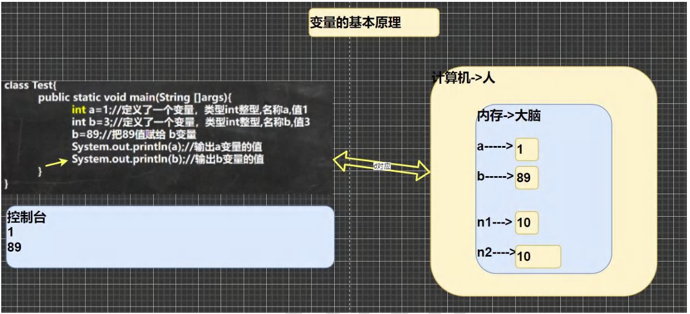
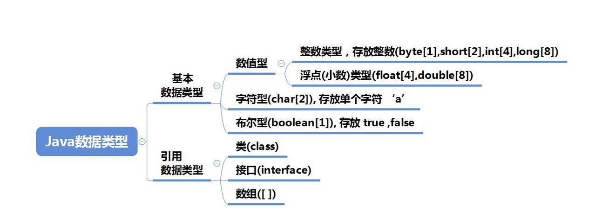
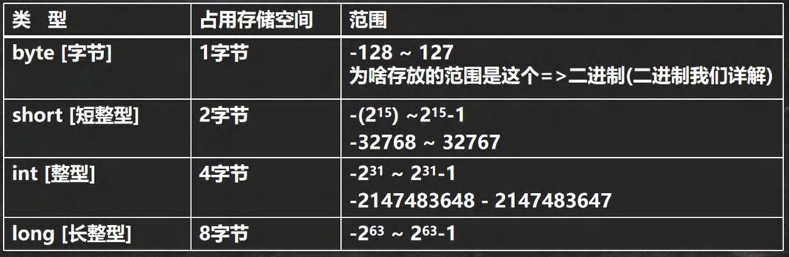
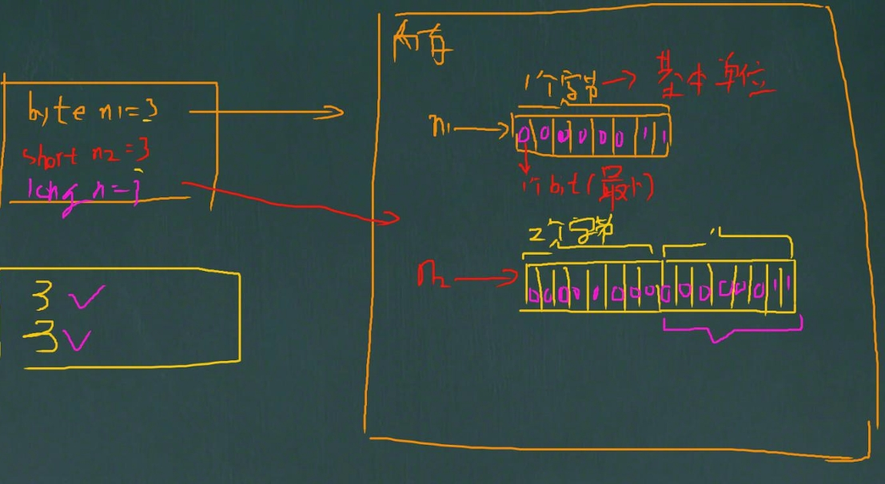

## Java变量

### 变量是程序的基本组成单位

```java
//不论是使用哪种高级程序语言编写程序，变量都是其程序的基本组成单位
//比如：变量有三个基本要素（类型+名称+值）
class Text{
    public static void main(String[] args){
        int a = 1;//定义了一个变量，类型 int 整型，名称 a，值 1
        int b = 3;//定义了一个变量，类型 int 整型。名称 b，值 3
        b = 89;//把 89 值赋给 b 变量；
        System.out.println(a);//1
        System.out.println(b);//89
    }
}
```



## 变（变化）量（值）的介绍

<b>变量相当于内存中一个数据存储空间</b>的表示，你可以把变量看做是一个房间的门牌号，通过<b>门牌号</b>我们可以找到房间，而 通过变量名可以访问到变量（值）

### 变量使用的基本步骤

1. 生命变量：int a;

2. 赋值

   a = 60;//应该把 60 赋给 a

   使用 System.out.println(a);//也可以一步到位【int a = 60】

## 变量快速入门

```java
 class Var02{
  public static void main(String[] args){
    //记录人的信息
    int age = 30;
    double score = 88.9;
    char gender ='男';
    String name="king";
    //输出信息，快捷键
    System.out.println("人的信息如下：");
    System.out.println(name);//king 
    System.out.println(age);//30
    System.out.println(score);//88.9
    System.out.println(gender);//男
  }
}
```

## 注意事项

:::tip

1. 变量表示内存中的一个存储区域【不同的变量，类型不同，占用的空间大小不同】，比如：int 4个字节，double 就是 8 个字节
2. 该区域有自己的名称【变量名】和类型【数据类型】
3. 变量必须先声明，后使用，既有顺序
4. 该区域的数据 / 值可以在<b>同一类型</b>范围内不断变化
5. 变量在同一个作用域内不能重名
6. 变量 = 变量名 + 值 + 数据类型，变量<b>三要素</b>

:::

```java

class VarDetail{
  public static void main(String[] args){
    //变量必须先声明。后使用，既有顺序
    int a = 50;//int
    System.out.println(a);//50
    //该区域的数据 / 值 可以在同一类型范围内不断变化
    // a = "jack";//x
    a=88;//对
    System.out.println(a);//88

    //变量在同一个作用域内不能重名
    //int a = 77; //错误
  }
}

class Dog{
  public static void main(String[] args){
    int a = 666;//对
  }
}
```

## 程序中 + 号的使用

:::tip

1. 当左右两边都是数值型时，则做加法运算
2. 当左右两边有一方为字符串，则做拼接运算
3. 运算顺序，是从左到右
4. 课堂测试题 1min

:::

```java
class VarDetail{
  public static void main(String[] args){
    System.out.println(100+98);//198
    System.out.println("100"+98);//10098
    System.out.println(100+3+"hello");//103hello
    System.out.println("hello" + 100 +3);//hello1003
  }
}
```

## 数据类型

每一种数据都定义了明确的数据类型，在内存中分配了不同大小的内存空间（字节）



```java
基本数据类型：
    整数类型 byte[1]，short[2]，int[4]，long[8]
    浮点（小数）类型：float[4]，double[8]
    字符型：char[2]，存放单个字符'a'
    布尔型：boolean[1]，存放 true ， false
引用数据类型：
    类：class
    接口：interface
    数组：[ ]
```

:::tip

1. java 数据类型分为两大类，基本数据类型，引用类型
2. 基本数据类型有 8 种，数值型：[ byte ，short，int，long，float，double ] char，boolean
3. 引用类型【类，接口，数组】

:::

## 数组类型

### 基本介绍

Java 的整数类型就是用于存放整数值的，比如12，30，3456等

```java
byte n1 = 10;
short n2 = 10;
int n3 = 10;//4个字符
long n4 = 10;//8个字符
```

### 整型的类型



### 整型的使用细节

:::tip

1. Java 各整数类型有固定的范围和字段长度，不受具体 OS 【操作系统】的影响，以保证 java 程序的可移植性
2. Java 的整型常量（具体值）默认为 int 型，声明 long 型常量须后加 ’I‘ 或 ’L‘
3. Java程序中变量常声明为 int 型，除非不足以表示大数，才使用 long
4. bit：计算机中的最小存储单位，byte:计算机中基本存储单元，1byte = 8bit 

:::



```java
public class IntDetail {
  public static void main(String[] args) {
    //Java 的整数常量（具体值）默认为 int 型，声明 long 型常量须后加 ‘l’或‘L’
    int n1 = 1;//4个字节
    //int n2 = 1L;//错误
    long n3 = 1L;//对
  }
}
```

## 浮点类型

### 基本介绍

`Java的浮点类型可以表示一个小数，比如123.4，7.8，0.12等`

### 浮点数分类

| 类型          | 占用存储空间 | 范围                   |
| ------------- | ------------ | ---------------------- |
| 单精度 float  | 4 字节       | -3.403E38 ~ 3.403E38   |
| 双精度 double | 8 字节       | -1.798E308 ~ 1.798E308 |

1. 浮点数在机器中存放形式的简单说明，<b>浮点数 = 符号位 + 指数位 + 尾数位</b>
2. 尾数部分可能丢失，造成精度损失（小数都是近似值）

### 浮点型使用细节

:::tip

1. 与整数类型类似，Java 浮点数也有固定的范围和字段长度，不受具体 OS 的影响，【float 4个字节 double 是 8 个字节】

2. Java 的浮点型常量（具体值）默认为 double 型，声明 float 型常量，须后加 “f” 或 “F”

3. 浮点型常量有两种表示形式

   十进制数形式：如：5.12   512.0f     .512 (必须有小数点)

   科学计数法形式，如：5.12e2 [5.12*10的2次方]  5.12E-2   【5.12 / 10 的2次方】

4. 通常情况下，应该使用 double 型，因为它比 flota 型更精确

   double num9 = 2.1234567851;

   float num10 = 2.1234567851F;

5. 浮点数使用陷阱：2.7  和 8.1 / 3 比较

:::

```java

class FloatDetail{
  public static void main(String[] args) {
    //Java 的附带念型常量（具体值）默认为 double 型，声明 float 型常量，须后加 ‘f’ 或 ‘F’
    //float num1 = 1.1;//错误
    float num2 = 1.1F;//对
    double num3 = 1.1;//对
    double num4  = 1.1F;//对

    //十进制数形式 如：5.12   512.0f     .512  (必须有小数点)
    double num5 = .123;//等价 0.123
    System.out.println(num5);//0.123

    //科学计数法形式: ：5.12e2[5.12*10的2次方 ]   5.12E-2   []
    System.out.println(5.12e2);//512.0
    System.out.println(5.12E-2);//0.0512

    //通常情况下，应该使用 double 型，因为它比float型更精确
    // double num9  2.1234567851; float num10 = 2.1234567851F;
    double num9 = 2.1234567851;
    float num10 = 2.1234567851F;

    System.out.println(num9);//2.1234567851
    System.out.println(num10);//2.1234567


    //浮点数使用陷阱 2.7 和 8.1 / 3 比较
    double num11 = 2.7;
    double num12 = 2.7; //8.1 / 3; //2.7
    System.out.println(num11);//2.7
    System.out.println(num12);//接近 2.7 的一个小数，而不是 2.7
    //得到一个重要的使用点: 当我们对运算结果是小数的进行相等判断是，要小心
    //应该是以两个数的差值的绝对值，在某个精度范围类判断

    if (num11 == num12){
      System.out.println("num11 == num12 相等");
    }
    //正确的写法 ,ctrl +/ 注释快捷键, 再次输入就取消注释
    if (Math.abs(num11 - num12)<0.00001){
      System.out.println("差值非常小，到我的规定精度，认为相等");
    }
    //可以通过 Java Api 查看
    System.out.println(Math.abs(num11 - num12));
    //细节：如果是直接查询得到的小数或者直接赋值，是可以判断相等的
  }
}
```

## Java API 文档

:::tip

1. API（Application Programming Interface，应用程序编码接口）是 Java 提供的基本编程接口（Java提供的类还有相关的方法）。中文在线文档：https://www.matools.com

2. Java 语言提供了大量的基础类，因此 Oracle 公司也为这些基础类提供了相应的 API 文档，用于告诉开发者如何使用这些类，一级这些类里面包含的方法

3. Java 类的组织形式

4. 举例说明如何使用 ArrayList   类有哪些方法

   安：包-->类-->方法

   直接索引：Math

:::


## 字符类型（char）

### 基本介绍

`字符类型可以表示单个字符，字符类型是 char,char是两个字节（可以存放汉字），多个字符我们用字符串 String`

```java
char c1 = 'a';
char c2 = '\t';
char c3 = '李';
char c4 = 97
```

### 字符类型使用细节

:::tip

1. 字符常量是用单引号（''）括起来的单个字符。例如：char c1 = 'a'；char c2  = '中'；char c3 = '9'；

2. Java 中还允许使用转义字符 '\' 来将其后的字符转变为特殊字符型常量：char c3 = '\n'；//'\n'表示换行符

3. 在 Java 中，char 的本质是一个整数，在输出时，是 unicode 码对应的字符

   http://tool.chinaz.com/Tools/Unicode.aspx

4. 可以直接给 char 赋一个整数，然后输出时，会按照对应的 unicode 字符输出【97->a】

5. char 类型是可以进行运算的，相当于一个整数，因为它都有对应的 Unicode 码。

:::

```java

class CharDetail{
  //main方法
  public static void main(String[] args){
    //在 Java 中，char 的本质是一个整数，在默认输出是，是 Unicode 码对应的字符
    //要输出对应的数字，可以 （int 字符）
    char c1 = 97;
    System.out.println(c1);//a

    char c2 = 'a';//输出 ‘a’对应的数字
    System.out.println((int) c2);//97

    char c3 = '李';
    System.out.println((int) c3);//26446

    char c4 = 26446;
    System.out.println(c4);//李

    //char 类型是可以进行运算的，相当于一个整数，因为它都对应有 Unicode 码
    System.out.println('a'  +10);//107
    
    //课堂测试
    char c5 = 'b' +1;//99
    System.out.println((int) c5);//99
    System.out.println(c5);//99  对应的字符，编码表ASCII（规定好的）
  }
}
```

:::tip

1. 字符型 存储到 计算机中，需要将字符对应的码值（整数）找出来，

   比如 'a' 存储：‘a’ ==>码值 97 ==> 二进制（1100001）==>存储

   读取：二进制（1100001）==> 97 ==> ‘a’ ==>显示

2. 字符和码值的对应关系是通过字符编码表决定的（规定好的）

:::

## Boolean类型

### 基本介绍

1. 布尔类型也叫 boolean 类型，boolean 类型数据只允许取值 `true` 和 `false`，无`null`
2. boolean 类型站 1 个字节
3. boolean 类型适于逻辑运算，一般用于程序流程控制

   if 条件控制语句；

   while循环控制语句；

   do-while 循环控制语句；

   for 循环控制语句；

   ```java
   boolean pass = true;
   if(pass){
       System.out.println("通过考试");
   }else{
       System.out.println("没有通过考试");
   }
   ```

```java
class Boolean{
  public static void main(String[] args){
    //定义一个布尔变量
    boolean isPass = true;
    if (isPass===true){
      System.out.println("考试通过");
    }else {
      System.out.println("考试没通过");
    }
  }
}
```

## 基本数据类型转换

### 自动类型转换

```java
1.当 java 程序在进行赋值或者运算时，精度晓得类型自动转换为精度达的数据类型，这就是自动类型转换
2.数据类型按精度（容量）大学排序
    char ---> int ---> long ---> float ---> double 
    byte ---> short ---> int ---> long ---> float ---> double
```

### 自动类型转换注意和细节

:::tip

1. 有多种类型的输一局混合运算时，系统首先自动将所有数据转换成容量最大的那种数据类型，然后再进行计算
2. 当我们把精度（容量）`大`的数据类型赋值给精度（容量）`小`的数据类型时，就会报错，反之就会惊醒自动类型转换
3. byte ，short ，char 他们三者都可以计算，再计算式首先转换为 int 类型
4. boolean 不参与转换
5. 自动提升原则：表达式结果的类型自动提升为 操作数中最大的类型

:::

```java
class AutoConvertDetail{
  public static void main(String[] args){
    //1.有多种类型的数据混合运算时，
    //系统首先自动将所有数据转换成容量  最大  的那种数据类型，然后再进行计算
    int n1 = 10;//ok
    //float d1 = n1 + 1.1；;// n1 + 1.1 => double
    double  d1 = n1 + 1.1;//对 n1 + 1.1 => 结果类型是 double
    float d2 = n1 + 1.1F;//对 n1 + 1.1F => 结果书记 float

    //2.当把精度（容量）大的数据类型赋值给精度（容量）小的数据类型时
    //就会报错，反之就会进行自动类型转换

    //int n2 = 1.1; 错误，double - > int

    //3.byte short 和 char 之间不会相互自动转换
    //当把具体数赋给 byte 时,1.先判断该数是否再 byte 范围内，如果是就可以
    byte b1 = 10;//对 -128 - 127；
    int n2 = 1;// n2 是 int
    //byte b2 = n2; 错误：如果是变量赋值，判断类型
    //char c1 = b1;//错误，原因 byte 不能自动转成 char


    //4.byte short  char 三者可以计算，在计算式首先转换成 int 类型
    byte b2 = 1;
    byte b3 = 2;
    short s1 = 1;
    //short s2 = b2 + s1; 错： b2 + s1 = >int;
    int s2  = b2 + s1;//对

    //byte b4 = b2 + b3; 错误 b2+b3 => int

    //boolean 不参与转换
    boolean pass = true;

    //int num100 = pass; //boolean 不参与类型的自动转换
    
    
    //自动提升原则：表达式结果的类型自动提升为 操作数中最大的类型
    byte b4 = 1;
    short s3 = 100;
    int num200 = 1;
    float num300 = 1.1F;
    
    float num500 = b4 + s3 + num200 + num300;
    double num600 = b4 + s3 + num200 + num300;
  }
}
```

### 强制类型转换

自动类型转换的逆过程，`将容量大的数据类型转换为容量小的数据类型`。使用时要加上强制转换符（），但可能造成`精度降低或溢出`，格外要注意

```java
class ForceConvert{
  public static void main(String[] args){
    int i = (int) 1.9;
    System.out.println(i);//1

    int j = 100;
    byte b1 = (byte)j;
    System.out.println(b1);//100
  }
}
```

### 强制类型转换细节

#### 细节说明

:::tip

1. 当进行数据的大学从 `大--->小`，就需要使用强制转换
2. 强转符号只针对于最近的操作数有效，往往会使用小括号提升优先级
3. char 类型可以保存 `int` 的常量值，但不能保存 `int` 的变量值，需要强转
4. byte 和 short ，char 类型在进行运算时，当作 int 类型处理

:::

```java
class ForceConvertDetail{
  public static void main(String[] args){
    //强转符号只针对于最近的操作数有效，往往会使用小括号提升优先级
    //int x = (int)10*3.5 + 6*1.5;//编译错误，double--> int
    int x = (int) (10*3.5+6*1.5);//(int)44-->44;
    
    char c1 = 100;
    int m = 100;
    
    //char c2 = m;错误
    char c3 = (char) m;
  }
}
```

```java
short s = 12;//ok
s = s-9;//错误 int --> short

byte b =10;//ok
b = b +11;//错误
b=(byte)(b+11);//ok

char c = 'a';
int i = 16;
float d = .314F;
double result = c+i+d;//ok

byte b = 16;
short s =14;
short t = s+b;//错误 int > short
```

## 基本数据类型和 String 类型的转换

### 介绍和使用

:::tip

1. 在程序开发中，经常需要将基本数据类型转成`String`类型，或者将`String`类型转成基本数据类型
2. 基本类型转`String`类型，语法：将基本类型的值+ “”即可，
3. `String`类型转基本数据类型，语法：通过基本类型的包装类调用 parseXX方法即可

:::

```java
class StringToBasic{
  public static void main(String[] args){
    //基本数据类型 String
    int n1 = 100;
    float f1 = 1.1F;
    double d1 = 4.5;
    boolean b1 = true;
    String s1 = n1 + "";
    String s2 = f1 + "";
    String s3 = d1 + "";
    String s4 = b1 + "";
    System.out.println(s1 + " " + s2 + " " + s3 + " " + s4);//100 1.1 4.5 true

    //String=>对应的基本数据类型
    String s5 = "123";
    //使用基本数据类型对应的包装类的相应的方法，得到基本数据类型
    int num1 = Integer.parseInt(s5);
    double num2 = Double.parseDouble(s5);
    float num3 = Float.parseFloat(s5);
    long num4 = Long.parseLong(s5);
    byte num5 = Byte.parseByte(s5);
    boolean b = Boolean.parseBoolean("true");
    short num6 = Short.parseShort(s5);

    System.out.println(num1);//123
    System.out.println(num2);//123.0
    System.out.println(num3);//123.0
    System.out.println(num4);//123
    System.out.println(num5);//123
    System.out.println(num6);//123
    System.out.println(b);//true

    //怎么把字符串转成字符 char --> 含义是指 把字符串的第一个字符得到
    System.out.println(s5.charAt(0));//1
  }
}
```

### 注意事项

1. 在将 `String` 类型转成 基本数据类型时，`要确保 String 类型能够转成有效的数据`，比如可以把 “123”,转成一个整数，但是不能把 “hello”转成一个整数
2. 如果格式不正确，就会`抛出异常，程序就会终止`

```java
class StringToBasicDetail{
  public static void main(String[] args){
    String str = "hello";
    //转成 int
    int n1 = Integer.parseInt(str);
    System.out.println(n1);
  }
}
```

```java
class Text01{
  public static void main(String[] args){
    int n1;
    n1 = 13;
    int n2;
    n2 = 17;
    int n3;
    n3 = n1 + n2;
    System.out.println("n3=" + n3);//30
    int n4 = 38;
    int n5 = n4 - n3;
    System.out.println("n5=" + n5);//8
  }
}
```

