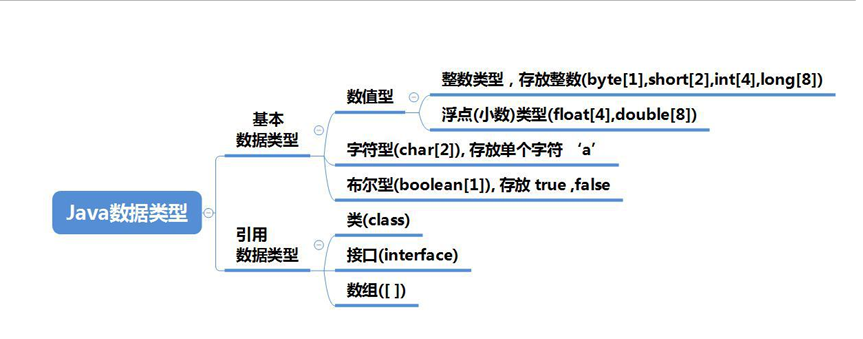

# java变量

## 变量的介绍

### 概念

**变量相当于内存中一个数据存储空间**的表示，可以把变量看做是一个房间的门牌号，通过**门牌号**可以找到房间，而通过变量名可以访问到变量（值）

```java
生命变量
    int a;
赋值
    a=60;//把 60 赋给 a
	使用 System.out.println(a);
//也可以一步到位 【int a = 60;】
```

### 变量使用注意事项

1. 变量表示内存中的一个存储区域【不同的变量，类型不同，占用的空间大小不同，比如 int 4个字节，double 8 个字节】
2. 该区域有自己的名称【变量名】和类型【数据类型】
3. 变量必须先声明，后使用，即有顺序
4. 该区域的数据 / 值 可以在 **同一类型**范围内不断变化
5. 变量在同一个作用域内不能重名
6. 变量 = 变量名 + 值 + 数据类型，**变量三要素**

```java
public class VarDetail {
  public static void main(String[] args) {
    int a = 50;//int
    System.out.println(a);//50
    //还区域的数据值可以在同一类型范围内不断变化
    //a="jack"
    a = 88;//对 
    System.out.println(a);//88
    
    //变量在同一个作用域内不能重名
    //int a = 77;//错误
  }
}
class Dog{
  public static void main(String[] args){
    int a = 666;//对
  }
}
```

### 程序中+号的使用

1. 当左右两边都是数值型时，则做**加法运算**
2. 当左右两边有一方为字符串，则做**拼接运算**
3. **运算顺序从左到右**

```java
ystem.out.println(100 + 98);//198
System.out.println("100" + 98);//10098

System.out.println(100 + 3 + 'hello');//103hello
System.out.println("hello" + 100 + 3);//hello1003
```

## 数据类型

每种数据都定义了明确的数据类型，在内存中分配了不同大小的内存空间（字节）



### 基本数据类型

```java
1.java 数据类型分为两大类型，基本数据类型，引用类型
2.基本数据类型有 8 中，数值型【 byte,short,int,long,float,double】 char,boolean    
3.引用类型【 类 接口 数组 】    
```

### 整数类型

Java 的整数类型就是用于存放整数值的，比如 12，30，3456

| 类型           | 占用存储空间 | 范围                     |
| -------------- | ------------ | ------------------------ |
| byte [字节]    | 1字节        | -128 ~ 127               |
| short [短整型] | 2字节        | -32768 ~ 32767           |
| int [整型]     | 4字节        | -2147483648 - 2147483647 |
| long [长整型]  | 8字节        | -2的63次方 ~ 2的63次方-1 |

### 整型的使用细节

```java
1.Java 各整数类型有固定的范围和字段长度，不受具体 OS【操作系统】的影响，以保证java程序的可移植性
2.Java 的整型常量（具体值）默认为 int 类型，声明 long 型常量须后加 "L"或"l"
3.java程序中变量常声明为 int 型，除非不足以表示大数，才使用 long
4.bit:计算机中的最小存储单位，byte：计算机中基本存储单元， 1byte = 8 bit
```

```java
// byte n1 = 3; short n2 = 3;
public class IntDetail {
  public static void main(String[] args){
    //Java 的整型常量（具体值）默认为 int 型，声明 long 型常量须后加 ”L“/”l“
    int n1=1;//4 个字节
    //int n2 = 1L;//错误
    long n3 = 1L;//对
  }
}
```

### 浮点类型

### 基本介绍

**Java 的浮点类型可以表示一个小数，比如 123.4    7.8   0.12**

### **浮点型的分类**

| 类型          | 占用存储空间 | 范围                   |
| ------------- | ------------ | ---------------------- |
| 单精度 float  | 4字节        | -3.403E38 ~ 3.403E38   |
| 双精度 double | 8字节        | -1.798E308 ~ 1.798E308 |

#### 注意

1. 关于浮点数在机器中存放形式的简单说明，**浮点数=符号位+指数位+尾数位*
2. 位数部分可能丢失，造成精度损失（小数都是近似值）

#### 浮点型使用细节

```java
1.与整数类型类似，Java 浮点类型也有固定的范围和字段长度，不受具体 OS 的影响，【float 4个字节 double 是8个字节】
2.Java 的浮点型常量（具体值）默认为 double 型，声明 float 型常量，须后加 ‘f’或‘F’
3.浮点型常量有 两种表示形式
    十进制数形式：如 5.12   512.0f  .512 (必须有小数点)
    科学计数法形式  5.12e2 [5.12*10 的2次方]  5.12E-2  【5.12/10的2次方】
4.通常情况下，应该使用 double 型，因为它比 float 型更精确
    double num1 = 2.1234567851;
	float num2 = 2.1234567851F;（知道 7 位小数）
5.浮点数使用陷阱： 2.7 和 8.1/3 比较
```

```java
public class FloatDetail {
  public static void main(String[] args) {
    //Java 的浮点型常量（具体值）默认为 double 型，声明 float 型常量，须后加 f 或 F
    //float num1 = 1.1;//错误
    float num2 = 1.1F;//对
    double num3 = 1.1;//对
    double num4 = 1.1F;//对

    //十进制数形式 5.12   512.0f   .512 （必须有小数点）
    double num5 = .123;//等价 0.123
    System.out.println(num5);
    //科学计数法形式  5.12e2[5.12 * 10的2次方]  5.12E-2
    System.out.println(5.12e2);//512.0
    System.out.println(5.12E-2);//0.0512

    //通常情况下，应该使用 double 型，因为它比 float 型更精确
    //double num9 = 2.1234567851   float num10 = 2.1234567851F;

    double num9 = 2.1234567851;
    float num10 = 2.1234567851F;
    System.out.println(num9);
    System.out.println(num10);

    //浮点数使用陷阱：2.7 和 8.1/3 比较
    double num11 = 2.7;
    double num12 = 2.7;//8.1 / 3 //2.7
    System.out.println(num12);//接近 2.7 的一个小数，而不是 2.7
    //得到一个重要的使用点: 当我们对运算结果是小数的进行相等判断是，要小心
    //应该是以两个数的差值的绝对值，在某个精度范围类判
    if (Math.abs(num11 - num12)<0.000001){
      System.out.println("差值分校小，认为相等");
    }
    //如果是直接查询得到的小数或者直接赋值，是可以判断相等
  }
}
```

### Java文档

1. API （Application Programming Interface,应用程序编程接口）是 Java 提供的基本编程接口（Java提供的类还有相关的方法）。

   中文在线文档：https://www.matools.com

2. Java 语言提供了大量的基础类，因此 Oracle 公司，也为这些基础类提供了相应的 API 文档，用于告诉开发者如何使用这些类，以及这些类里包含的方法

3. Java 类的组织形式


### 字符类型

> 字符类型可以表示单个字符，字符类型是 char,char是两个字节（可以存放汉字），多个字符我们用字符串 string

```java
char c1 = 'a';
char c2 = '\t';
char c3 = '韩';
char c4 = 97;//a
```

#### 字符类型使用细节

1. 字符常量是用单引号（‘’）括起来的，例如：char c1 = 'a'; char c2 = '中'；char c3 = '9';
2. Java 中还允许使用转义字符 ‘\’ 来将其后的字符转变为特殊字符型常量，例如：cahr c3 = '\n';//表示换行符
3. 在 Java 中，char 的本质是一个整数，在输出时，是 **unicode**码对应的字符
4. 可以直接给 char 赋一个整数，然后输出时，会按照对应的 unicode 字符输出【97=> a】
5. char 类型是可以进行运算的，相当于一个整数，因为它都对应有 **Unicode** 码

```java
public class CharDetail {
    public static void main(String[] args){
        //在 java中，char的本质是一个整数，在默认输出时，时 unicode 码对应的字符
        //要输出对应的数字，可以 (int) 字符
        char c1 = 97;
        System.out.println(c1);//a
        char c2 = 'a';//输出 'a' 对应的数字
        System.out.println((int)c2);//97
        char c3 = '韩';
        System.out.println((int)c3);//38889
        char c4 = 38889;
        System.out.println(c4);//韩
        //char 类型是可以进行运算的，相当于一个整数，因为它都对应有 Unicode 码
        System.out.println('a' + 10);//107
        char c5 = 'b'+1;//99
        System.out.println(c5);// 99==>对应的字符-->编码表ASCII（规定好的）==》c
    }
}
```

1. 字符型 存储到计算机中，需要将字符对应的码值（整数）找出来，比如‘a’

   存储：‘a’ ==> 码值97 ===> 二进制（110 0001）==> 存储

   读取：二进制 ==> （110 0001）==> 97 ==> 'a' ==> 显示

2. 字符和码值的对应关系是通过字符编码表决定的（规定好的）

## Boolean

### 基本介绍

1. 布尔类型也叫**Boolean**类型，**Boolean**类型数据只允许取值 **true**和**false**，无 null

2. boolean 类型占一个字节

3. boolean 类型适于逻辑运算，一般用于程序流程控制

   if条件控制语句

   while 循环控制语句

   do-while 循环控制语句

   for 循环控制语句

```java
public class boolean01 {
    public static void main(String[] args){
        //演示判断成绩是否通过
        boolean isPass = true;
        if (isPass){
            System.out.println("考试通过");
        }else {
            System.out.println("下次努力");
        }
    }
}
```

## 基本数据类型转换

### 自动类型转换

1. 当**Java**程序在进行赋值或者运算时，精度晓得类型自动转换为精度大的数据类型，这个就是 自动类型转换
2. 数据按照精度（容量）大小为排序

```java
char --> int --> long --> float --> double 
byte --> short --> int --> long --> float --> double    
```

### 自动类型转换主要和细节

1. 有多种类型的数据混合运算时，系统首先自动将所有数据转换成容量最大的那种数据类型，然后再进行计算
2. 当我们把精度（容量）大 的数据类型赋值给进度（容量）小 的数据类型时，就会报错，反之就会进行自动类型转换
3. （byte，short）和 char 之间不会相互自动转换
4. byte，short，char 它们三者可以计算，在计算时首先转换为 int 类型
5. boolean 不参与转换
6. 自动提升原则：表达式结果得到类型自动提升为 操作数中最多的类型

```java
//自动类型转换细节
public class AutoConvertDetail {
  //编写一个 main 方法
  public static void main(String[] args) {
    //细节1：有多种类型的数据混合运算时
    //系统首先自动将所有数据转换成容量最大的那种数据类型，然后再进行计算
    int n1 = 10;//ok
    // float d1 = n1 + 1.1;//错误 n1 + 1.1 => 结果类型是 double
    // double d1 = n1 + 1.1;//对 n1 + 1.1 => 结果类型是 double
    float d1 = n1 + 1.1F;//对 n1 + 1.1 =>结果类型是 float

    //细节2：当我们把精度（容量）大 的数据类型赋值给精度（容量）小 的数据类型时
    //就会报错，反之就会进行自动类型转换

    //int n2 = 1.1; //错误 double --> int

    //细节3：（byte，short）和 char 之间不会相互自动转换
    //当把具体数赋给 byte 时，（1）先判断该数是否再 byte 范围内，如果是就可以
    byte b1 = 10;//对 -128 ~ 127
    //int n2 = 1;//n2 是 int
    //byte b2 = n2;//错误。原因：如果是变量赋值，判断类型

    //char c1 = b1;// 错误：原因 byte 不能自动转成 char

    //细节4：byte short char 他们三至可以计算，在计算式首先转换为 int 类型
    byte b2 = 1;
    byte b3 = 2;
    short s1 = 1;
    //short s2 = b2 + s1; 错误：b2 + s1 ==>int类型
    int s2 = b2 + s1;//对 b2 + s1 => int

    //byte b4 = b2 + b3;//错误：b2+b3=>int

    //boolean 不参与转换
    boolean pass = true;

    //自动提升原则：表达式结果的类型自动提升为 操作数中最大的类型

    byte b4 = 1;
    short s4 = 100;
    int num4 = 1;
    float num400 = 1.1F;

    double numAll = b4 + s4 + num400 + num4;//float => double
  }
}
```

### 强制类型转换

自动类型转换的逆过程，**将容量大的数据类型转换为容量小的数据类型**，使用时要加上强制转换符**()**，

但可能造成**精度降低或溢出**，格外注意

```java
public class ForceConvert {
  public static void main(String[] args){
    int i = (int) 1.9;
    System.out.println(i);//1

    int j = 100;
    byte b1 = (byte) j;
    System.out.println(b1);//100
  }
}
```

### 强制类型转换细节说明

1. 当进行数据的大小从 **大-->小**，就需要使用到强制转换
2. 强转符号只针对于最近的操作数有效，往往会使用小括号提升优先级
3. **char**类型可以保存**int**的常量值，但不能保存**int**的变量值，需要强转
4. **byte**和**short**，**char** 类型在进行运算时，当作**int**类型处理

```java
public class ForceConvertDetail {
  public static void main(String[] args){
    //强转符号只针对于最近的操作数有效，往往会使用小括号提升优先级
    //int x =(int)10*3.5 + 6*1.5;//错误 int ==> double
    int x = (int) (10*3.5 + 6*1.5);//（int）44.0=>44
    System.out.println(x);//44
    
    char c1 = 100;//ok
    int m = 100;//ok
     //char c2 = m;//错误
    char c3 = (char) m;//ok
    System.out.println(c3);//100 对应的字符 d 字符
  }
}
```

#### 练习

```java
public class Test {
  public static void main(String[] args) {
    short s = 12;//ok
    //s = s-9;//错误 int > short

    byte b = 10;//ok
    //b = b + 11;//错误 int > byte

    char c = 'a';//ok
    int i = 16;//ok
    float d = .314F;//ok
    double result = c + i + d;//ok

    byte b4 = 16;//ok
    short s4 = 14;//ok
    //short t4 = s4 + b4;//错误 int> short
  }
}
```

### String 类型转换

1. 在程序开发中，经常需要将基本数据类型转成**String**类型，或将**String**类型转成基本数据类型
2. 基本数据类型转 **String**类型，语法：将基本类型的值 + ‘’ 即可
3. **String**类型转基本数据类型，语法：通过基本类型的包装类调用 parseXX 方法即可

```java
public class StringToBasic {
  public static void main(String[] args) {
    //基本数据类型=>String
    int n1 = 100;
    float f1 = 1.1F;
    double d1 = 4.5;
    boolean b1 = true;
    String s1 = n1 + "";
    String s2 = f1 + "";
    String s3 = d1 + "";
    String s4 = b1 + "";
    System.out.println(s1 + " " + s2 + " " + s3 + " " + s4);//100 1.1 4.5 true

    //String=> 对应的基本数据类型
    String s5 ="123";
    //解读 使用基本数据类型对应的包装类的相应方法，得到基本数据类型
    int num1 = Integer.parseInt(s5);
    double num2 = Double.parseDouble(s5);
    float num3 = Float.parseFloat(s5);
    float num4 = Long.parseLong(s5);
    byte num5 = Byte.parseByte(s5);
    boolean b = Boolean.parseBoolean("true");
    short num6 = Short.parseShort(s5);

    System.out.println(num1);//123
    System.out.println(num2);//123.0
    System.out.println(num3);//123.0
    System.out.println(num4);//123.0
    System.out.println(num5);//123
    System.out.println(b);//true
    System.out.println(num6);//123

    //怎么把字符串转成字符 char =>含义是指 把字符串的第一个字符得到
    //解读 s5.charAt(0) 得到 s5 字符串的第一个字符'I'
    System.out.println(s5.charAt(0));//1
  }
}
```

#### 注意事项

1. 在将**String**类型转成**基本数据类型时，要确保 String 类型能够转成有效的数据**，比如 可以把 “123” 转成一个整数，但是不能把 “hello” 转成一个整数
2. 如果格式不正确就会 **抛出异常，程序就会终止**

```java
public class StringToBasicDetail {
  public static void main(String[] args) {
    String str = "hello";
    //转成 int
    int n1 = Integer.parseInt(str);
    System.out.println(n1);//报错
  }
}
```

#### 练习

```java
public class Homework {
  public static void main(String[] args){
    int n1;
    n1 = 13;
    int n2;
    n2 = 17;
    int n3;
    n3 = n1 + n2;
    System.out.println("n3=" + n3);//30
    int n4 = 38;
    int n5 = n4 - n3;
    System.out.println("n5=" + n5);//8
  }
}
```

