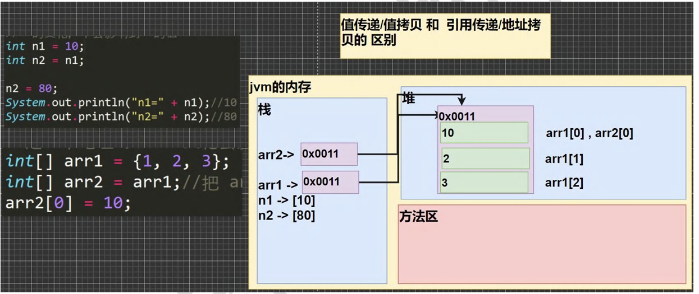
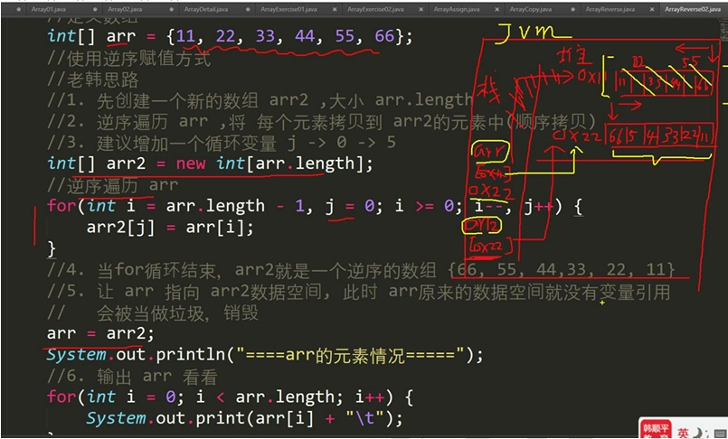

# 数组

## 数组介绍

`数组`可以存放多个同一类型的数据，数组也是一种数据类型，是引用类型

即：数（数据）组（一组）就是一组数据

```java
class ArrayTest{
  public static void main(String[] args){
    /*
    * 它们的体重分别手机 3kg,5kg,1kg,3.4kg,2kg.50kg
    * 这六只鸡的总体种风格是多少，平均体重
    * */
    double[] hens = {3,5,1,3.4,2,50,7.8,88.8,1.1,5.6,100};

    double totalWeight = 0;
    for (int i=0;i<hens.length;i++){
      totalWeight+=hens[i];
    }
    System.out.print(totalWeight);
    System.out.print(totalWeight/hens.length);
  }
}
```

### 数组使用

```java
1.数组定义
    数据类型 数组名[] = new 数据类型【大小】
    int a[] = new int[5];//创建了一个数组，名字 a ,存放 5 个 int
	说明：这是定义数组的一种方法，
2.数组的引用
	数组名【下标/索引/index】比如：你要使用a数组的第三个数 a[2]
	数组的下标从 0 开始
```

```java
import java.util.Scanner;
class ArrayText{
  public static void main(String[] args){
    //数据类型 数组名[] = new 数据类型【大小】
    //循环输入 5 个成绩，保存到 double 数组，病输出
    //1.创建一个 double 数组，大小 5
    //(1)第一种动态分配方式
    //double scores[] = new double[5];
    //(2)第2中动态分配方式，先声明数组，在 new 分配空间
    double scores[];//声明数组，这时 scores  是 null
    scores = new double[5];//分配内层空间，可以存放数据

    //2.玄幻输入
    //scores.length 表示数组的大小/长度
    Scanner myScanner = new Scanner(System.in);
    for (int i=0;i<scores.length;i++){
      System.out.print("请输入第"+(i+1)+"个元素的值");
      scores[i] = myScanner.nextDouble();
    }

    System.out.print("==数组的元素/值的情况");
    for (int i = 0; i < scores.length; i++) {
      System.out.print("第"+(i+1)+"个元素的值="+scores[i]);
    }
  }
}
```

### 动态初始化

1. 先声明数组

   语法：数据类型 数组名[]；也可以  数据类型[]  数组名；

   int a[]；或者 int[] a;

2. 创建数组

   语法：数组名 = new 数据类型【大小】

   a = new int[10]

```java
1.初始化数组
    语法：数据类型 数组名[] = {元素值，元素值...}
	int a[] = {2,5,6,7,8,89,90,34,56};//如果指定数组有多少元素
	int a[] = new int[9];
	a[0]=2;a[1]=5;a[2]=6;a[3]=7;a[4]=8;a[5]=89;a[6]=90;a[7]=34;a[8]=56;

double hens[] = {3,5,1,3.4,2,50};
double hens[] = new double[6];
hens[0]=3;hens[1]=5;hens[2]=1;hens[3]=3.4;hens[4]=2;hens[5]=50;
```

### 数组使用细节

:::tip

1. `数组`是多个`相同类型数据的组合`，实现对这些数据的`统一管理`

2. `数组`中的元素可以是`任何数据类型`，包括`基本类型`和`引用类型`，但是不能`混用`

3. `数组`创建后。如果没有赋值，有默认值

   ```java
   int 0,short 0,byte 0,long 0,float 0.0, char \u0000 ,boolean false ，String null
   ```

4. 使用数组的步骤 1.声明数组并开辟空间，2.给数组各个元素赋值  ，3.使用数组

5. 数组的`下标是从 0 开始的`

6. 数组下标必须在``指定范围内使用，否则报：下标越界异常

   ```java
   int[] arr = new int[5];//有效下标为 0-4
   
   ```

7. 数组属引用类型，数组类型数据是对象（object）

:::

```java
class ArrayDetail{
  public static void main(String[] args){
    //1.数组是多个相同类型数据的组合，实现对这些数据的统一管理
    //int[] arr1 = {1,2,3,6,"hello"}; String -> int
    double[] arr2 = {1.1,2.2,3.3,60.6,100};//int -> double

    //2.数组中的元素可以是任何数据类型，包括基本类型和引用类型，到那时不能混用
    String[] arr3 = {"济南","leo","main"};

    //3.数组创建后，如果没有赋值，有默认值
    //int 0, short 0 , byte 0 ， long 0
    //float 0.0，double 0.0，char \u0000,
    //boolean false  String null
    short[] arr4 = new short[3];
    System.out.print("===数组 arr4 ===");

    for (int i = 0; i < arr4.length; i++) {
      System.out.println(arr4[i]);
    }

    //6.数组下标必须在指定范围内使用，否则报：下标越界异常
    //int[] arr = new int[5];则有效下标为 0-4
    //即数组的下标/索引 最小 0  最大 数组长度 -1（4）
    int[] arr = new int[5];
    //System.out.println(arr[5]); //数组越界
  }
}
```

## 数组的赋值机制

1. 基本数据类型赋值，这个值就是具体的数据，而且互相不影响

   ​	

   ```java
   int n1=2;int n2=n1;
   ```

2. 数组在默认情况下是引用传递，赋的值是地址

   ```java
   int[] arr1 = {1,2,3};
   int[] arr2 = arr1;
   ```

   

## 数组拷贝

编写代码，实现数组拷贝（内容复制）

```java
//将 int[] arr1 = {10,20,30};拷贝到 arr2 数组，要求数据空间是独立的

class ArrayCopy{
  public static void main(String[] args){
    //将 int[] arr1 = {10,20,30};拷贝到 arr2 数组
    //要求数据空间是独立的

    int[] arr1 = {10,20,30};

    //创建一个新的数组 arr2,开辟新的数据空间 arr1.length
    int[] arr2 = new int[arr1.length];

    //遍历 arr1 ,把每个元素拷贝到 arr2 对应的元素位置
    for (int i = 0; i < arr1.length; i++) {
      arr2[i] = arr1[i];
    }
    //修改 arr2 不会对 arr1 有影响
    arr2[0]=100;
    
    //输出 arr1
    System.out.println("=== arr1 的元素 ===");

    for (int i = 0; i < arr1.length; i++) {
      System.out.println(arr1[i]);//10,20,30
    }
    
    System.out.println("=== arr2 的元素 ===");
    for (int i = 0; i < arr2.length; i++) {
      System.out.println(arr2[i]);
    }
  }
}
```

## 数组反转

要求：把数组的元素内容反转 

```java
arr {11,22,33,44,55,66}   {66,55,44,33,22,11}

class ArrayReverse{
  public static void main(String[] args){
    //定义数组
    int[] arr = {11,22,33,44,55,66};

    //1.把 arr[0] 和 arr[5] 进行交换 {66，55，44，33，22，11}
    //2.把 arr[1] 和 arr[4] 进行交换 {66，55，44，33，22，11}
    //3.把 arr[2] 和 arr[3] 进行交换 {66，55，44，33，22，11}
    //4.一共要交换 3 次 = arr.length / 2
    //5.每次交换时，对应的下标 时 arr[i] 和 arr[arr.length-1 - i]
    int temp=0;
    int len = arr.length;//计算数组的长度
    for (int i = 0; i < len/2; i++) {
      temp=arr[len-1-i];//保存
      arr[len-1-i] = arr[i];
      arr[i] = temp;
    }

    for (int i = 0; i < arr.length; i++) {
      System.out.println(arr[i]);
    }
  }
}
```



## 数组添加/扩容

要求：实现动态的给数组添加元素效果，实现对数组扩容

1. 原始数组使用静态分配 `int[] arr = {1,2,3}`
1. 增加的元素 4，直接放在数的最后 `arr = {1,2,3,4}`
1. 用户可以通过以下方法决定是否继续添加，添加成功，是否继续

```java
import java.util.Scanner;
class ArrayAdd{
  public static void main(String[] args){
    /*
    * 要求：实现动态的给数组添加元素效果，实现对数组扩容。ArrayAdd.java
    * 1.原始数组使用静态分配 int[]arr={1,2,3}
    * 2.增加的元素4，直接放在数组的最后 arr={1,2,3,4}
    * 3.用户可以通过如下方法来决定是否继续添加，添加成功，是否继续？y/n
    * 思路分析
    * 1. 定义初始数组 int[]arr={1,2,3}//下标 0-2
    * 2. 定义一个新的数组 int[]arrNew=newint[arr.length+1];
    * 3. 遍历 arr 数组，依次将arr的元素拷贝到 arrNew数组
    * 4. 将 4 赋给 arrNew[arrNew.length- 1] = 4;把 4 赋给arrNew 最后一个元素
    * 5. 让 arr 指向 arrNew; arr=arrNew; 那么 原来arr数组就被销毁
    * 6. 创建一个 Scanner可以接受用户输入
    * 7. 因为用户什么时候退出，不确定，使用 do-while+break来控制
    * */
    Scanner myScanner = new Scanner(System.in);
    //初始化数组
    int[] arr = {1,2,3};
    do {
      int[] arrNew = new int[arr.length+1];
      //遍历 arr 数组，依次将 arr 的元素拷贝到 arrNew 数组
      for (int i = 0; i < arr.length; i++) {
        arrNew[i]=arr[i];
      }
      System.out.println("请输入要添加的元素");
      int addNum = myScanner.nextInt();
      //把 addNum 赋给 arrNew 最后一个元素
      arrNew[arrNew.length-1] = addNum;
      //让 arr 指向 arrNew
      arr = arrNew;
      //输出 arr
      System.out.println("arr 扩容后情况");
      for (int i = 0; i < arr.length; i++) {
        System.out.println(arr[i]);
      }
      System.out.println("是否继续");
      char key = myScanner.next().charAt(0);
      if (key=='n'){//如果输入 n 就结束
        break;
      }
    }while (true);
    System.out.println("退出添加");
  }
}
```

```java
class ArrayText{
  public static void main(String[] args){
    int[] arr = {1,2,3};
    int[] arrNew = new int[arr.length-1];
    //遍历arr 数组，一次将 arr 的元素拷贝到 arrNew 数组
    for (int i = 0; i < arr.length; i++) {
      arrNew[i] = arr[i];
    }
    arrNew[arrNew.length-1] = 4;
    arr = arrNew;
  }
}
```

## 排序介绍

`排序是将多个数据，依指定的顺序进行排列的过程`

### 内部排序

:::tip

指将需要处理的所有数据都在加载到内部存储器中进行排序，包括`（交换式排序法，选择式排序法和插入式排序法）`

:::

### 外部排序法

冒泡排序（bubble Sorting）的基本思想是：通过对待排序序列从后向前（从下标较大的元素开始），一次比较相邻元素的值，若发现逆序则交换，使值较大的元素逐渐 `从前移向后部`，就像水底下的气泡一样 `逐渐向上冒`

## 冒泡排序法

:::tip

1. 一共 5 个元素
2. 一共进行了 4 轮排序，可以看出外层循环
3. 每 1 轮排序可以确定一个数的位置，比如第 1 轮排序确定最大数，第 2 轮排序，确定第 2 大的数位置，一次类推
4. 当进行比较时，如果前面的数大于后面的数，就交换
5. 每轮比较在减少 4->3->2->1

:::

```java
class BubbleSort{
  public static void main(String[] args){
    /*
    * 数组 【24，69，80，57，13】
    * 第 1 轮排序：目标把最大数放在最后
    * 第 1 次比较【24，69，80，57，13】
    * 第 2 次比较【24，69，80，57，13】
    * 第 3 次比较 【24，69，57，80，13】
    * 第 4 次比较 【24，69，57，13，80】
    * */
    int[] arr = {24,69,80,57,13,-1,30,200,-110};
    int temp=0;//用于辅助交换的变量
    //将多轮排序使用外层循环包括起来即可
    //先死后活，  4 就是 arr.length-1;
    for (int i = 0; i < arr.length-1; i++) {//外层循环是 4 次
      for (int j = 0; j < arr.length-1-i; j++) {//4次比较 3次 2次  1次
        //如果前面的数>后面的数，就交换
        if (arr[j]>arr[j+1]){
          temp = arr[j];
          arr[j] = arr[j+1];
          arr[j+1] = temp;
        }
      }
      System.out.println(i+1);

      for (int j = 0; j < arr.length; j++) {
        System.out.print(arr[j]);
      }
    }

  }
}
```

## 查找

1. 查找顺序
2. 二分查找【二分法】

```java
//有一个数列：白眉鹰王、金毛狮王、紫衫龙王、青翼蝠王猜数游戏：从键盘中任意输入一个名称，判断数列中是否
//包含此名称【顺序查找】要求:如果找到了，就提示找到，并给出下标值
import java.util.Scanner;
class SeqSearch{
  public static void main(String[] args){
    /*
    * 有一个数列：白眉鹰王、金毛狮王、紫衫龙王、青翼蝠王猜数游戏：
    * 从键盘中任意输入一个名称，判断数列中是否包含此名称【顺序查找】
    * 要求:如果找到了，就提示找到，并给出下标值
    *
    * 1.定义一个字符串数组
    * 2.接收用户输入，遍历数组，逐一比较，则提示信息，并退出
    * */

    String[] names = {"白眉鹰王", "金毛狮王", "紫衫龙王", "青翼蝠王"};
    Scanner myScanner = new Scanner(System.in);

    System.out.println("请输入姓名");
    String findName = myScanner.next();

    //遍历数组，逐一比较，如果有 则提示信息，并退出
    int index = -1;
    for (int i = 0; i < names.length; i++) {
      //比较 字符串比较equals,如果要找到名字就是当前元素
      if (findName.equals(names[i])){
        System.out.println(findName);
        System.out.println(i);
        //把 index = i;
        break;//退出
      }
    }
    if (index==-1){
      System.out.println(findName);
    }
  }
}
```

## 多维数组-二维数组

多维数组=》二维数组

```java
class TwoDimensionalArray{
  public static void main(String[] args) {
    /*
     * 0 0 0 0 0 0
     * 0 0 1 0 0 0
     * 0 2 0 3 0 0
     * 0 0 0 0 0 0
     * */

    //1.定义形式上 int[][]
    //2.原来的一维数组的每个元素是一维数组，就构成二维数组
    int[][] arr = {
        {0,0,0,0,0,0},
        {0,0,1,0,0,0},
        {0,2,0,3,0,0},
        {0,0,0,0,0,0},
    };
    System.out.println(arr.length);
    //1.二位数组的每个元素是一维数组，所以如果需要得到每个一维数组的值。
    //2.访问第（i+1）个一维数组的第 j+1 个值 arr[i][j]
    System.out.println(arr[2][3]);
    for(int i=0;i<arr.length;i++){
      //遍历二维数组的每个元素
      //遍历二维数组的每个元素(数组)
      //1.arr[i]表示二维数组的第i+1个元素比如arr[0]：二维数组的第一个元素
      //2.arr[i].length得到对应的每个一维数组的长度
      for(int j=0;j<arr[i].length;j++){
        System.out.print(arr[i][j]+"");//输出了一维数组
      }
      System.out.println();//换行
    }
  }
}
```

### 动态初始化

```java
//1.语法：类型[][] 数组名 = new 类型[大小][大小]
//2.比如：int a[][] = new int[2][3]
//3.二维数组在内层的村阿紫形式
class TwoDimensionalArray{
  public static void main(String[] args) {
    //int arr[][] = new int[2][3];

    int arr[][];//声明二维数组
    arr = new int[2][3];//再开空间

    arr[1][1]=8;
    //遍历数组
    for (int i = 0; i < arr.length; i++) {
      for (int j = 0; j < arr[i].length; j++) {//对每个一维数组遍历
        System.out.print(arr[i][j]);//000  080
      }
      System.out.println();//换行
    }
  }
}
```


### 动态初始化2

先声明：类型  数组名[][];

在定义（开辟空间）数组名 = new 类型[大小][大小]

赋值（有默认值，比如 int  类型记得就是 0）

```java
class TwoDimensionalArray{
  public static void main(String[] args) {

    /*
    * 看个需求：动态创建下面二维数组
    * i=0;1
    * i=1;2 2
    * i=2;3 3 3
    *
    * 一个有三个一维数组，每个一维数组的元素是不一样的
    * */
    //创建 二维数组，一个有 3 个一维数组，但是每个一维数组还没有开数据空间
    int[][] arr = new int[3][];

    for (int i = 0; i < arr.length; i++) {//遍历 arr 每个一维数组
      //给每个一维数组开空间 new
      //如果没有给一维数组 new ,那么 arr[i] 就是 null
      arr[i] = new int[i+1];

      //遍历一维数组，并给一维数组的每个元素赋值
      for (int j = 0; j < arr[i].length; j++) {
        arr[i][j]=i+1;//赋值
      }
    }
    
    //遍历输出arr
    for (int i = 0; i < arr.length; i++) {
      //输出 arr 的每个一维数组
      for (int j = 0; j < arr[i].length; j++) {
        System.out.print(arr[i][j]);
      }
      System.out.println();
    }

  }
}
```

### 静态初始化

```java
定义 类型 数组名[][] = {{值 1，值 2}，{值 1，值 2...},{值 1，值 2}}
使用即可
    int[][] arr = {{1,1,1},{8,8,9},{100}}
1.定义了一个二维数组 arr
2.arr 有三个元素（每个元素）    
3.第一个一维数组有 3 个元素，第二个一维数组有 3个元素，第三个一维数组有 1 个元素    
```

```java
class TwoDimensionalArray{
  public static void main(String[] args) {
    int arr[][]={{4,6},{1,4,5,7},{-2}};
    int sum = 0;
    for (int i = 0; i < arr.length; i++) {
      for (int j = 0; j < arr[i].length; j++) {
        sum+=arr[i][j];
      }
    }
  }
}
```

### 二维数组使用细节和注意事项

```java
1.一维数组的声明方式
    int[] x  或者 int x[];
2.二维数组的声明方式
    int[][] y  或者   int[] y[]   或者  int y[][]
3.二维数组实际上是由多个一维数组组成，它的各个一维数组的长度可以相同，也可以不相同，比如： map[][] 是一个二维数组
    int map[][] = {{1,2},{3,4,5}};
	由 map[0] 是一个含有两个元素的一维数组，map[1] 是一个含有三个元素的一维数组构成，称为列数不等的二维数组
        
声明：int[] x,y[];
说明：x 是 int 类型的一维数组，y 是 int 类型的二维数组
    x[0] = y; //错误 int[][] --> int
	y[0] = x; //正确 int[] --> int[]
	y[0][0] = x; //错误 int[] --> int[]
	x[0][0] = y; //错误 x[0][0] 是错误
	y[0][0] = x[0]; //正确 int --> int;
```

```java
//定义数组正确的
1.String strs[] = {'a','b','c'}; //错误 ''--> ""
2.String[] strs = {"a","b","c"}; //正确
3.String[] strs = new String{"a","b","c"}; //错误 
4.String strs[] = new String[]{"a","b","c"}; //正确
5.String[] strs = new String[3]{"a","b","c"};
```

```java
String foo = "blue";
boolean[] bar = new boolean[2];//默认值 为 false
if(bar[0]){
    foo="greeb"
}
System.out.println(foo);//blue
```

```java
while (num<10){
    System.out.println(num);//1 3 5 7
    if (num>5){
    	break;
    }
    num+=2;
}
```

```java
//已知有个升序的数组，要求插入一个元素，该数组顺序依然是升序，
//【10，12，45，90】 添加 23 后数组为 【10，12，23，45，90】
class Homework{
  public static void main(String[] args){
    int[] arr = {10,12,45,90};
    int insertNum=111;
    int index = -1;
    for (int i = 0; i < arr.length; i++) {
      if (insertNum<=arr[i]){
        index = i;
        break;
      }
    }
    if (index==-1){
      index = arr.length;
    }
    int[] arrNew = new int[arr.length + 1];
    for(int i = 0, j = 0; i < arrNew.length; i++) {
      if (i!=index){
        arrNew[i] = arr[j];
        j++;
      }else {
        arrNew[i] = insertNum;
      }
    }
    arr = arrNew;
    for (int i = 0; i < arr.length; i++) {
      System.out.print(arr[i]);//10 12 45 90 111
    }
  }
}
```

```java
//随机生成 10 个整数（1-100的范围）保存到数组，并
// 倒序打印以及求平均值，求最大值和最大值的下标，并查找里面是否有 8

class Homework{
  public static void main(String[] args){
    int[] arr = new int[10];

    for (int i = 0; i < arr.length; i++) {
      arr[i] = (int) (Math.random()*100)+1;
    }

    for (int i = 0; i < arr.length; i++) {
      System.out.print(arr[i]+"\t");
    }

    for (int i = arr.length-1; i >=0 ; i--) {
      System.out.print(arr[i]+"\t");
    }

    double sum = arr[0];
    int max = arr[0];
    int maxIndex = 0;
    for (int i = 0; i < arr.length; i++) {

      sum+=arr[i];

      if (max<arr[i]){
        max = arr[i];
        maxIndex = i;
      }
    }

    System.out.println(sum/arr.length);

    int findNum = 8;
    int index = -1;
    for (int i = 0; i < arr.length; i++) {
      if (findNum == arr[i]){
        index=i;
        break;
      }
    }

    if (index==-1){
      System.out.println("findNum="+findNum);
    }
  }
}
```

```java
class Homework{
  public static void main(String[] args){
    char[] arr1 = {'a','z','b','c'};
    char[] arr2 = arr1;
    arr1[2] = '李';
    for (int i = 0; i < arr2.length; i++) {
      System.out.println(arr1[i] + ',' + arr2[i]);//238  288  52936  242
    }
  }
}
```

### 冒泡代码

```java
//冒泡代码
class Homework{
  public static void main(String[] args){

    int[] arr = {20,-1,89,2,890,7};

    int temp=0;

    for (int i = 0; i < arr.length-1; i++) {
      for (int j = 0; j < arr.length-1-i; j++) {
        if (arr[j]>arr[j+1]){
          temp = arr[j];
          arr[j] = arr[j+1];
          arr[j+1] = temp;
        }
      }
    }

    for (int i = 0; i < arr.length; i++) {
      System.out.print(arr[i]+"\t");
    }

  }
}
```

