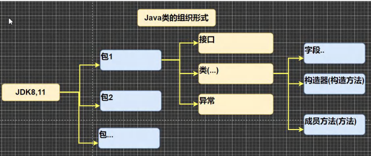
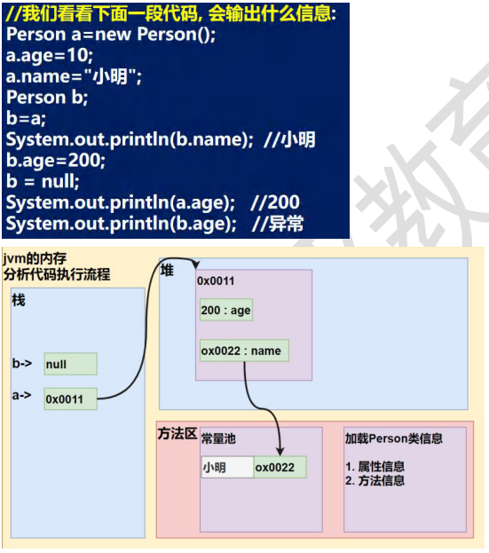
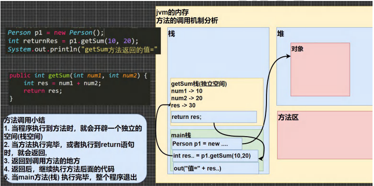
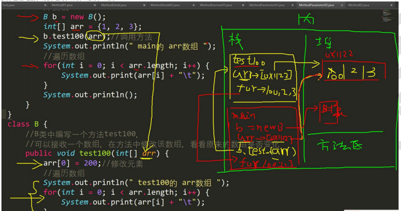
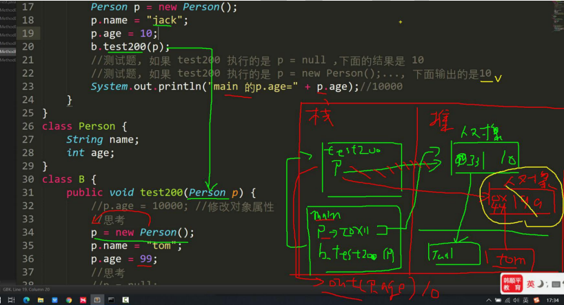
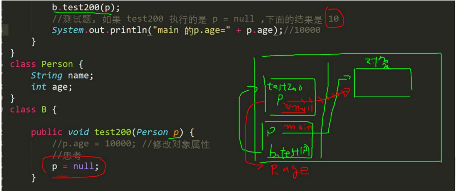

# 程序控制结构

`在程序中，程序运行的流程控制决定程序是如何执行的`

:::tip

1. 顺序控制
2. 分支控制
3. 循环控制

:::

## 分支控制 if-else

### 分支控制 if-else 介绍

1. 单分支 if
2. 双分支 if-else
3. 多分枝 if-else if-...-else

#### 单分支

```java
//基本语法
if(条件表达式){
    执行代码块；（可有多条语句）
}
//说明：当条件表达式为 true 时，就会执行 { } 的代码，如果为 false ，就不执行，
//特别说明：如果 { } 中 有一条语句，则可以不用 {}
```


#### 双分支

```java
//基本语法
if(条件表达式){
    执行代码块1
}else{
    执行代码块2
}
//说明：当条件表达式成立，即执行代码块1，否则执行代码块2，如果执行代码块只有一条语句，则 {} 可以省略，否则 ， 不能省略
```



#### 多分枝

```java
//基本语法
if(条件表达式1){
    执行代码块1
}else if(条件表达式2){
    执行代码块2
}...else{
    执行代码块n
}
//特别说明：1.多分支，可以没有 else，如果所有的条件表达式都不成立，则一个执行入口都没有，
//2.如果有 else ，如果所有的条件表达式都不成立，则默认执行 else 代码块
```



## 嵌套分支

`在一个分支结构中又完整的嵌套了另一个完整的分支结构`，里面的分支的结构称为内层分支外面的分支结构称为外层分支

### 基本语法

```java
if(){
    if(){
        //if-else
    }else{
        //if-else
    }
}
```

## switch分支结构

### 基本语法

```java
switch ('表达式'){
  case 常量1：//
  break;
  case 常量2；
    语句2；
    break;
  ....
  case 常量n;
  break;
  default:
    default语句块
  break      
}
//1.switch 关键字，表示 switch 分支
//2.表达式对用一个值
//3.case 常量1 当表达式的值等于常量1，就执行语句块1 
//4.break:表示退出 switch
//5.如果和 case 常量1 匹配，就执行语句块 1，如果没有匹配，就系系匹配 case 常量2
//6.如果一个都没有匹配上，执行 default 语句
```

### 流程图



### switch注意事项

```java
1.表达式数据类型，应和 case 后的常量`类型一致`，或者是可以 `自动转成` 可以相互比较的类型，比如输入的是字符，而常量是 int 
2.switch （表达式）中表达式的返回值必须是：（byte，short，int，char，enum[枚举]，String）
double c = 1.1;
switch(c){//错误
    case 1.1://错误
    	System.out.println("ok3");
        break;
}
3.case 子句中的值必须是常量，而不能是变量
4.default 子句是可选的，当没有匹配的 case 是，执行 default
5.break 语句用来在执行完一个 case 分支后使用程序跳出 switch 语句块，如果没有写 break,程序会顺序执行到 switch 结尾，除非遇到 break    
```

### switch 和 if 的比较

1. 如果 `判断的具体数值不多`，而且符合 `byte、short、int、char、enum[枚举]、String`这 6 中类型，虽然两个语句都可以使用，建议使用 switch 语句
2. 其他情况：对区间判断，对结果为 `boolean` 类型判断，使用 `if、if的使用范围更广`

## for循环控制

```java
for(循环变量初始化；循环条件；循环变量迭代){
    循环操作（可以多条语句）
}
```

:::tip

1. for 关键字，表示循环控制
2. for 有四要素：（1）循环变量初始化（2）循环条件（3）循环操作（4）循环变量迭代
3. 循环操作，这里可以有多条语句，也就是我们要执行的代码
4. 如果 循环操作（语句） 只有一条语句，可以省略 { }，建议不要省略

:::

### for 循环执行流程分析

1. 使用 `for` 循环完成前面的题
2. 画出 `for` 流程图


### 注意事项

1. 循环条件是返回一个布尔值的表达式
2. for（循环判断条件）中的初始化和变量迭代可以写到其它地方，但是两边的逗号不能省略
3. 循环初始值可以有多条初始化语句，但要求类型一样，并且中间用逗号隔开，循环变量迭代也可以有多条变量迭代语句，中间用逗号隔开
4. 使用内存分析法

## while循环控制

```java
//循环变量初始化
while(循环条件){
    循环体（语句）
    循环变量迭代
}
1. while 循环也有四要素
2. 只是四要素放的位置和 for 不一样    
```



```java
class While01{
  public static void main(String[] args){
    //输出10句 你好
    int i =1;//玄幻变量初始化
    while (i<=10){//循环条件
      System.out.println("你好" + i);
      i++;//循环变量迭代
    }
    System.out.println("退出")
  }
}
```

### 注意事项

1. 循环条件是返回一个布尔值的表达式
2. while 循环是先判断再执行语句

```java
//打印 1-100 之间所有能被 3 整除的数
//打印 40-200 之间所有偶数，
class WhileExercise{
  public static void main(String[] args){
    int i = 1;
    int endNum = 100;
    while (i<=endNum){
      if (i%3==0){
        System.out.println("i=" + i);
      }
      i++;
    }

    int j =40;
    while (j<=200){
      if (j%2==0){
        System.out.println("j=" + j);
      }
      j++;
    }
  }
}
```

## do..while循环控制

```java
基本变量初始化
    do{
        循环体（语句）；
        循环变量迭代    
    }while(循环条件)
```

:::tip

1. `do while`是关键字
2. 也有循环四要素，只是位置不一样
3. 先执行，在判断，也就是说，一定会至少执行一次
4. 最后一个 分号 ；
5. while 和 do..while 区别举例：

:::

### do...while循环执行流程



```java
//1.使用 do...while 循环
//2.代码执行内存
class DoWhile{
  public static void main(String[] args){
    //输出 10 句话，
    int i = 1;//循环变量初始化
    do {
      //循环执行语句
      System.out.println("你好"+i);
      //循环变量迭代
      i++;
    }while (i<=10);
    System.out.println("退出 do...while 继续执行..");
  }
}
```

```java
class DoWhileExercise {
 public static void main(String[] args){
   //统计 1-200之间能被5整除但不能被3整除的个数
   int i =1;
   int count=0;//统计满足条件的个数
   do {
     if (i%5==0&&i%3!=0){
       System.out.println("i="+i);
       count++;
     }
     i++;
   }while (i<=200);
   System.out.println("cpunt=" + count);
 }
}
```

## 多重循环控制

:::tip

1. 将一个循环放在另一个循环体内，就形成了嵌套循环。其中 `for，while，do...while`均可以作为外层循环和内层循环；【建议一般使用两层，最多不要超过三层，否则，代码可读性很差】
2. 实质上，嵌套循环就是把内层循环当成外层循环的循环体，当只有内存循环的循环条件为 `false`时，才会完全跳出内层循环，才可结束外层的当次循环，开始下一次的循环
3. 设外循环次数为 `m`次，内层为 `n`次，则内层循环体实际上需要执行 `m*n`次

   ```java
   for(int i =1;i<=7;i++){//第一次循环 7
       for(int j =1;j<=2;j++){//第二层循环 2
           System.out.println("ok~~");// 7 * 2
       }
       
   }
   ```

:::

### 多重循环执行步骤分析

```java
for(int i = 0; i < 2; i++) { //先思考
    for( int j = 0; j < 3; j++) {
    	System.out.println("i=" + i + j=" + j);
    }
}
```

```java
//1.统计 3 个班成绩情况，每个班有5名同学，求出各个班的平均分和所有班级的平均分
//2.统计三个班及格人数，每个班有 5 名同学
import java.util.Scanner;

class MullForExercise {
 public static void main(String[] args){
    //统计3个班成绩情况，每个班有5名同学，
    //求出各个班的平均分和所有班级的平均分[学生的成绩从键盘输入]。
    //统计三个班及格人数，每个班有5名同学。

    //化繁为简
    //(1) 先计算一个班 ,5个学生的成绩和平均分 , 使用for
    //1.1 创建 Scanner 对象然后，接收用户输入
    //1.2 得到该班级的平均分 , 定义一个 doubelsum 把该班级5个学生的成绩累积
    //(2) 统计 3 个班(每个班5个学生) 平均分
    //(3) 所有班级的平均分
    //3.1 定义一个变量，doubletotalScore 累积所有学生的成绩
    //3.2 当多重循环结束后，totalScore /(3*5)
    //(4) 统计三个班及格人数
    //4.1 定义变量 intpassNum =0; 当有一个学生成绩>=60,passNum++
    //4.2 如果 >=60passNum++
    //(5) 可以优化[效率，可读性, 结构]
    //创建 Scanner 对象
   Scanner myScanner = new Scanner(System.in);
   double totalScore = 0;//累计所有学生的成绩
   int passNum =0;//累积 几个人数
   int classNum = 3;//班级个数
   int stuNum = 5;//学生个数

   for (int i = 0; i <=classNum; i++) {//i 表示班级
     double sum = 0;//一个班级的总分
     for (int j = 0; j <=stuNum; j++) {//j 表示学生
       System.out.println("请数第" + i+"个班级的第"+j+"个学生的成绩");
       double score = myScanner.nextDouble();
       //当有一个学生成绩>=60，passNum++
       if (score>=60){
         passNum++;
       }
       sum+=score;//积累
       System.out.println("成绩为"+score);
     }

     //因为 sum 是 5 个学生的总成绩
     System.out.println("sum=" + sum+"平均分="+(sum/stuNum));
     //把 sum 累积到 totalScore
     totalScore+=sum;

   }
   System.out.println("三个班总分="+totalScore+"平均分="+totalScore/(classNum*stuNum));
   System.out.println("及格人数="+passNum);
 }
}
```

### 经典

```java

class Stars{
  public static void main(String[] args){
    //打印金字塔
    int totalLevel = 20;//层数
    for (int i=1;i<=totalLevel;i++){//表示层数
      //在输出 * 之前，还有输出 对应的空格 = 总层数-当前层
      for (int k=1;k<=totalLevel-i;k++){
        System.out.print(" ");
      }

      //控制打印每层的 * 个数
      for (int j = 0; j <=2*i ; j++) {
        //当前行的第一个位置是 * ,最后一个位置也是 *，最后一层全部 *
        if (j==1||j==2*i||i==totalLevel){
          System.out.print("*");
        }else {//其他情况输出空格
          System.out.print(" ");
        }
      }
      //每打印完一层的 * 后，就换行 println 本身就会换行
      System.out.println("");
    }
  }
}
```

### break

```java
随机生成1-100的一个数，直到生成了97这个数，看看你一共用了几次?
提示使用 (int)(Math.random() * 100) + 1
思路分析：
循环，但是循环的次数不知道.->break,当某个条件满足时，终止循环
通过该需求可以说明其它流程控制的必要性，比如break
```

`break 语句用于种植某个语句块的执行`一般使用在 `switch`或者循环`[for，while，do...while]中`

```java
//基本语法
{
    break;
}  
```



### 注意事项说明

```java
1.break 语句出现在多层嵌套的语句块中时，可以通过 标签 指明要终止的是哪一层语句块
2.标签的基本使用
    label1:{}
	label2:{}
//1.break 语句可以指定退出哪层
//2.label1 是标签，名字有程序员指定
//3.break 后指定到哪个 label 就退出到哪里
//4.在实际开发中，不建议使用标签
//5.如果没有指定 break,默认退出最近的循环体
```

```java

class BreakExercise{
  public static void main(String[] args){
    //1-100 以内求和，求出 当和 第一次大于20 的当前数【for+break】
    int sum=0;//累积和
    //注意 i 的作用范围在 for{}
    int n =0;
    for (int i=1;i<=100;i++){
      sum+=i;
      if (sum>20){
        System.out.print("和>20时候 当前数i=" + i);
        n=i;
        break;
      }
    }
    System.out.print("当前数=" + n);
  }
}
```

### 跳转控制语句continue

:::tip

1. `continue 语句用于结束本次循环，继续执行下一次循环`
2. `continue` 语句出现在多层嵌套的循环语句体中，可以通过标签指明要跳过的是哪一层循环，这个和前面的标签的使用的规则一样

:::

```java
{......
    continue;
 ......
}
```

#### 以 while 使用 continue 


```java
class ContinueText{
  public static void main(String[] args){
    int i =1;
    while (i<=4){
      i++;
      if (i==2){
        continue;
      }
      System.out.print("i=" + i);
    }
  }
}
```

### 跳转控制语句 return

`return`使用在方法，表示跳出所在的方法，`如果 return 写在 main 方法，退出程序。。。`

```java
for (int i=1;i<=5;i++){
  if (i==3){
    System.out.print(i);
    return;//continue;break
  }
  System.out.print("hello world");
}
System.out.print("go on");
```

