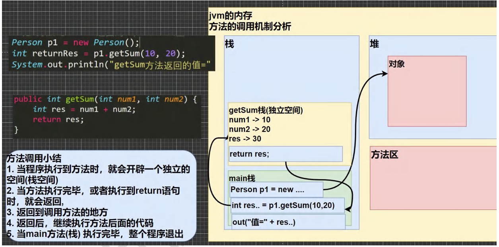
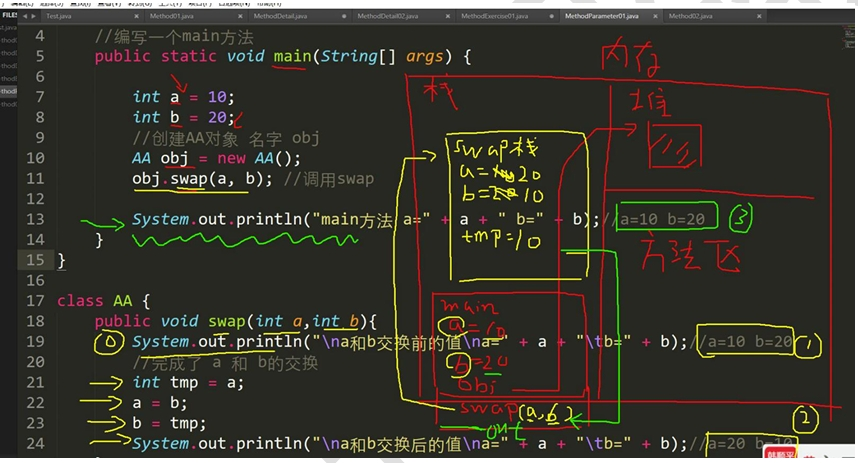
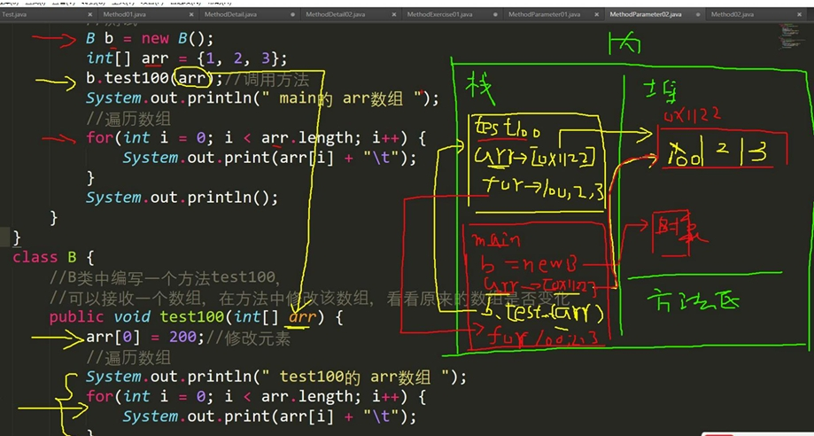
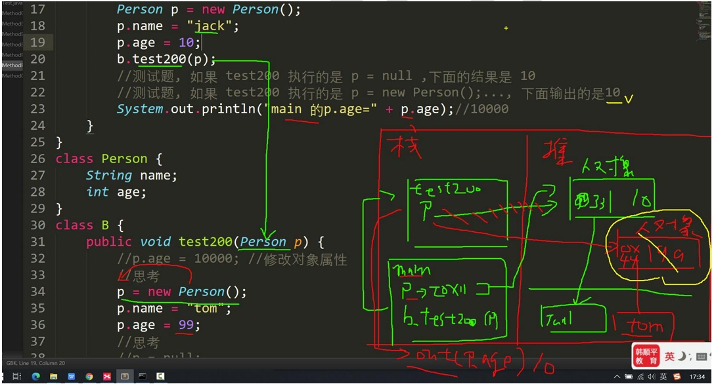
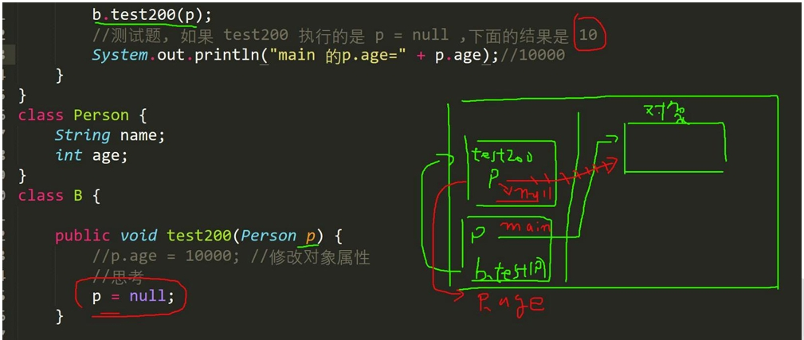
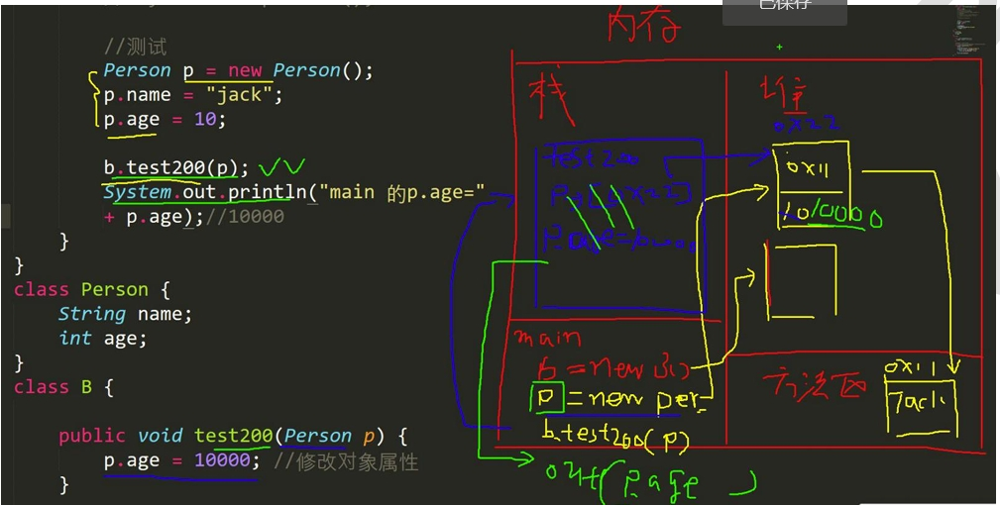
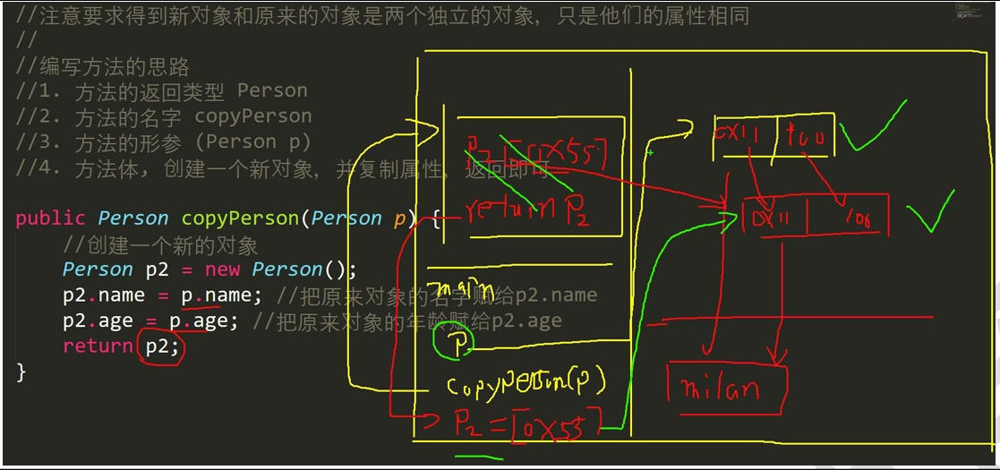
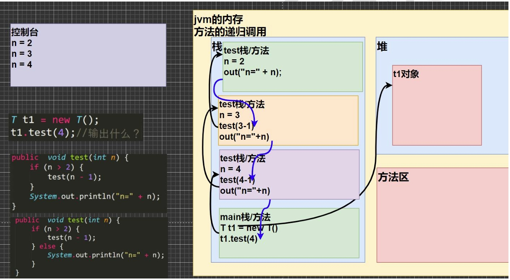
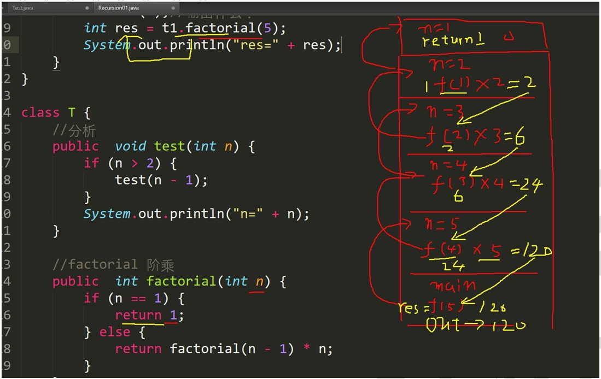

# 面向对象（基）

## 类与对象

### 类和对象的区别

1. 类是抽象的，概念的，代表一类事物，比如人类，猫类...，即 `它是数据类型`
2. 对象是具体的，实际的，代表一个具体事物，即 `是实例`
3. 类是对象的模板，对象的类的一个个体，对应一个实例

### 对象在内存中存在形式


### 属性/成员变量/字段

```java
//从概念或叫法上看：成员变量= 属性 = field(字段)
//（即 成员变量是用来表示属性的）
class ObjectText{
  public static void main(String[] args){}
}

class Car{
  String name;//属性 成员变量 字段 field;
  double price;
  String color;
  String[] master;//属性可以是基本数据类型，也可以是引用类型（对象，数组）
}
//属性是类的一个组成部分，一般是基本数据类型，也可以是引用类型（对象，数组）
```

### 注意事项和细节说明

1. 属性的定义语法同变量，示例：访问修饰符，属性类型 属性名；

   ​	四种修饰符 `public，proctected，默认，private`

2. 属性的定义类型可以为任意类型，包含`基本类型`或`引用类型`

3. 属性如果不赋值，有默认值，规则和数组一致，具体说：`int 0，short 0，byte 0，long 0，float 0.0，double 0.0，char \u0000，boolean false，String null`

```java
class PropertiesDetail{
  public static void main(String[] args){
    //创建 Person 对象
    //p1 是对象名（对象引用）
    //new Person() 创建的对象空间（数据）才是真正的对象
    Person p1 = new Person();

    //对象的属性默认值，遵守数组规则
    //int 0，short 0，byte 0，long 0，float 0.0，double 0.0，char \u0000，boolean false，String null
    //age=0name=nullsal=0.0isPass=false
    System.out.println("age=" + p1.age + "name=" + p1.name + "sal=" + p1.sal + "isPass=" + p1.isPass);//

  }
}
class Person{
  //四个属性
  int age;
  String name;
  double sal;
  boolean isPass;
}
```

### 创建对象

1. 先声明再创建

   Cat cat;//声明对象  cat

   cat = new Cat();//创建

2. 直接创建

   Cat cat = new Cat();

### 如何访问属性

```java
//基本语法
对象名.属性名
	cat.name;
	cat.age;
	cat.color;
//类和对象的内层分配机制
class Object03{
  public static void main(String[] args){
    Person p1 = new Person();
    p1.age=10;
    p1.name="李";
    Person p2 = p1;
    System.out.println(p2.age);//10
  }
}
class Person{
  public int age;
  public String name;
}
```


### 类和对象的内层分配机制

#### java 内存的结构分析

1. 栈：一般存放基本数据类型（局部变量）
2. 堆：存放对象（Cat cat，数组等）
3. 方法区：常量池（常量，比如字符串），类加载信息

#### Java 创建对象的流程

```java
Person p = new Person();
p.name = "Leo";
p.age = 10;
```

1. 先加载 `Person` 类信息（属性和方法信息，只会加载一次）
2. 在堆中分配空间，进行默认初始化
3. 把地址赋给p，p 就指向对象
4. 进行指定初始化，比如 `p.name = 'Leo'  p.age = 10`;

```java

class ObjectTest{
  public static void main(String[] args){
    Person a = new Person();
    a.age=10;
    a.name="Leo";
    Person b;
    b=a;
    System.out.println(b.name);//Leo
    b.age=200;
    b=null;
    System.out.println(a.age);//200
    System.out.println(b.age);//异常
  }
}

class Person{
  public int age;
  public String name;
}
```


## 成员方法

### 基本介绍

在某些情况下，我们需要定义成员方法（简称：方法）。比如人类：除了有一些属性外（年龄，姓名...），我们人类还有一些行为，比如：可以说话，跑步,,,，通过学习，还可以做算术题，这时就要用 `成员方法` 才能完成，现在要求对 `Person` 类完善

```java
class MethodText{
  public static void main(String[] args){
    //1.添加 speak 成员方法 输出 text
    //2.添加 cal01 成员方法，可以计算从 1+...+ 1000 的结果
    //3.添加 cal02 成员方法，该方法可以接收一个数 n，计算从 1+...+n的结果
    //4.添加 getSum 成员方法，可以提计算两个数的和

    Person p1 = new Person();
    p1.speak();;
    p1.cal01();;
    p1.cal02(5);
    p1.cal02(1);
    int returnRes = p1.getSum(10,20);
    System.out.println("getSum方法返回的值" + returnRes);

  }
}
class Person{
  String name;
  int age;
  // public 方法是公开的
  //void 表示方法没有返回值
  public void speak(){
    System.out.println("text");
  }
  public void cal01(){
    int res=0;
    for (int i = 0; i <=1000; i++) {
      res+=i;
    }
    System.out.println("cal01方法结果" + res);
  }
  //cal02方法
  public void cal02(int n){
    int res=0;
    for (int i = 0; i <=n; i++) {
      res+=n;
    }
    System.out.println("cal02方法结果" + res);
  }
  public int getSum(int num1,int num2){
    int res= num1+num2;
    return res;
  }
}
```

### 方法的调用机制原理



### 成员方法的好处

1. 提高代码的复用性
2. 可以将实现的细节封装起来，然后供其他用户来调用即可

### 成员方法的定义

```java
访问修饰符 返回数据类型   方法名（形参列表...）}{//方法体
	语句；
     return 返回值；
}
```

1. 形参列表：表示成员方法输入 cal（int n）, getSum(int num1,int num2);
2. 返回数据类型，表示成员方法输出，void 表示 `没有返回值`
3. 方法主体；表示为了实现某一功能代码块
4. `return` 语句不是必须的

```java
class MethodText{
  public static void main(String[] args){

    AA a = new AA();
    int[] res = a.getSumAndSub(1,4);
    System.out.println("和"+res[0]);
    System.out.println("差"+res[1]);

    //细节：调用带参数的方法时，一定对应着参数列表传入相同类型或兼容类型 的参数
    byte b1 =1;
    byte b2 = 2;
    a.getSumAndSub(b1,b2);//byte--> int
    //细节：实参和形参的类型要一致或兼容，个数，顺序必须一致
  }
}

class AA{
  //细节：方法不能嵌套定义
  public void f4(){
    //错误
   /* public void f5(){

    }*/
  }

  public void f3(String str,int n){
  }

  //1.一个方法最多有一个返回值，
  public int[] getSumAndSub(int n1,int n2){
    int[] resArr = new int[2];
    resArr[0] = n1+n2;
    resArr[1] = n1-n2;
    return resArr;
  }

  //2.返回类型可以为任意类型，包含基本类型或引用类型（数组，对象）

  //3.如果方法要求返回数据类型，则方法中最后的执行语句必须为 return 值
  //而且要求返回值类型必须 和 return 的值类型一致或兼容
  public double f1(){
    double d1 = 1.1*3;
    int n = 100;
    return n;// int --> double

    //return d1;//ok double --> int
  }

  //如果方法是 void 则方法体中可以没有 return语句，或者 只写 return
  public void f2(){
    System.out.println("hello1");
    System.out.println("hello1");
    System.out.println("hello1");
    int n =10;
  }
}
```

`访问修饰符（作用时控制 方法使用的范围）`

`如果不写，默认访问【有四种：public，protected，默认，private】`

#### 返回数据类型

:::tip

1. 一个方法最多有一个返回值
2. 返回类型可以为任意类型，包含`基本类型`或`引用类型`（`数组，对象`）
3. 如果方法要求有`返回数据类型`，则方法体中最后的执行语句必须为 `return` 值；而且要求 `返回值类型必须`和 `return`的值类型`一致或兼容`
4. 如果方法是 `void`，则方法体中可以没有 `return` 语句，或者 只写 `return`

:::

#### 方法名

遵循 `驼峰命名法`，最好 `见名知义`,表达出该功能的意思即可，

#### 形参列表

1. 一个方法可以有 0 个参数，也可以有多个参数，中间用逗号隔开，比如 `getSum(int n1,int n2)`
2. 参数类型可以为 `任意类型`，包含`基本类型`或`引用类型`，比如 `printArr(int[][] map)`
3. 调用带参数的方法时，一定对应着参数列表传入`相同类型`或`兼容类型`的参数，【getSum】
4. 方法定义的参数称为`形式参数`，简称`形参`；方法调用时的传入参数称为`实际参数`，简称`实参`，`实参`和`形参`的类型要`一致或兼容、个数、顺序、必须一致`

#### 方法体

里面写完功能的具体的语句，可以为`输入、输出、变量、运算、分支、循环、方法调用`，但里面不能再定义方法，即方法不能嵌套定义

```java
//1.同一个类中的方法调用，直接调用即可，比如 print(参数)
//2.跨类中的方法 A 类调用 B 类方法：需要通过对象名调用，比如 对象名.方法名（参数）；
//3.跨类的方法调用和方法的访问修饰符线管，

class MethodDetail{
  public static void main(String[] args){
    A a = new A();
    a.sayOK();
    
    a.m1();
  }
}
class A{
  //同一个类中的方法调用，直接调用即可
  public void print(int n){
    System.out.println("print()方法被调用n" + n);
  }
  public void sayOK(){//sayOK 调用 print(直接调用即可)
    print(10);
    System.out.println("继续执行 sayOK()~~");
  }
  //跨类中的方法 A 类 调用 B 类方法，需要通过对象名调用

  public void m1(){
    //创建 B 对象，然后再调用方法即可
    System.out.println("m1() 方法被调用");
    B b= new B();
    b.hi();
  }
}

class B{
  public void hi(){
    System.out.println("B 类中的 hi() 被执行");
  }
}
```

### 类定义的完善

```java
class 类名 {属性}-->class 类名{属性（成员变量）；成员方法}-->待定。。。
```

```java
//1.编写类 AA，有一个方法，判断一个属时奇数 odd 还是偶数，返回boolean
//2.根据行、列、字符打印 对应行数和列数的字符，比如 行 4 列4 字符 #；则打印相应的效果

class MethodExercise{
  public static void main(String[] args){
    AA a = new AA();
    if (a.isOdd(2)){//T
      System.out.println("是奇数");
    }else {
      System.out.println("是偶数");
    }
    a.print(3,3,'*');
  }
}
//编写类 AA，有一个方法：判断一个数是奇数 odd 还是偶数，返回 boolean
class AA{
  //1.方法返回类型 boolean
  //2.方法的名字 isOdd
  //3.方法的形参 （int num）
  //4.方法体，判断
  public boolean isOdd(int num){
    return num%2!=0;
  }

  //根据行、列、字符打印 对应行数和列数的字符
  //比如 行 4 列 4 字符 # 则打印相应的效果
  //1.方法的返回类型 void
  //2.方法的名字 print
  //3.方法的形参（int row,int col,char c）
  //4.方法体，循环
  public void print(int row,int col,char c){
    for (int i = 0; i < row; i++) {
      for (int j = 0; j < col; j++) {
        System.out.print(c);
      }
      System.out.println();//换行
    }
  }
}
```

## 成员方法传参机制

方法的传参机制对我们今后的编程非常重要，一定要搞的清清楚楚明明白白

### 基本数据类型的传参机制

```java
class MethodsTest{
  public static void main(String[] args){
    int a = 10;
    int b=20;
    //创建AA 对象，名字 obj
    AA obj = new AA();
    obj.swap(a,b);

    System.out.println("main方法a="+a+"b="+b);//a=10 b=20;
  }
}
class AA{
  public void swap(int a,int b){
    System.out.println("\na和 b 交换前的值\na=" +a +"\tb=" + b);//a=10 b=20
    //完成 a 和 b 的交换
    int tmp = a;
    a=b;
    b=tmp;
    System.out.println("\na和b交换后的值\na="+a+"\tb="+b);//a=20  b =10
  }
}
```



### 引用数据类型的传参机制

```java
//B 类中编写一个方法 test100，可以接收一个数组，再方法中修改该数组看看原来数组是否变化？（会变化）
//B 类中编写一个方法 test200，可以接收一个 Person(age,sal)对象，在方法中方修改该对象属性，看看原来的对象是否变化？（会变化）
class MethodParameter{
  public static void main(String[] args){
    B b = new B();
    int[] arr = {1,2,3};
    b.test100(arr);
    System.out.println("main 中的 arr 数组");
    for (int i = 0; i < arr.length; i++) {
      System.out.print(arr[i]+"\t");//200 2 3
    }

    Person p = new Person();
    p.name="Leo";
    p.age=10;
    b.test200(p);
    //如果 test200 执行 p=null;则 p.age = 10;把自己空间内存的 p 制空
    //如果 test200 执行的 是 p = new Person(); 输出的是 10 
    System.out.println(p.age);//1000
  }
}
class Person{
  String name;
  int age;
}
class B{
  public void test200(Person p){
    //p.age=1000;
    p=null;
    p = new Person();
    p.name="Leo";
    p.age=99;
  }
  //B 类中编写一个 test100
  public void test100(int[] arr){
    arr[0]=200;//修改元素
    //遍历数组
    System.out.println("test100 的 arr数组");
    for (int i = 0; i < arr.length; i++) {
      System.out.print(arr[i]+"\t");//200 2 3
    }
  }
}
```

#### 结论示意图

引用类型的是`地址`（传递也是`值`，但是值是`地址`），可以通过形参影响





#### 案例

下面的方法会对原来的对象有影响吗

```java
p=null 和 p=new Person();
```





### 成员方法返回类型是引用类型应用实例

```java
1.编写类 MyTool 类，编写一个方法可以打印二维数组的数据
2.编写一个方法 copyPerson，可以赋值一个 Person 对象，返回赋值的对象，克隆对象，注意要求得到新对象和原来的对象是两个独立的对象，只是他们的属性相同    
```

```java

class MethodExercise{
  public static void main(String[] args){
    Person p = new Person();
    p.name="Leo";
    p.age=30;

    //创建 tools
    MyTools tools = new MyTools();
    Person p2 = tools.copyPerson(p);

    //到此 p 和 p2 是 Person 对象,但是是两个独立的对象，属性相容
    System.out.println("p的属性 age="+p.age + "名字="+p.name);
    System.out.println("p2的属性 age="+p2.age + "名字="+p2.name);
    System.out.println(p==p2);//false
  }
}

class Person{
  String name;
  int age;
}
class MyTools{
  //编写一个 copyPerson，可以复制一个 Person 对象，返回赋值对象，克隆对象
  //注意：要求得到新对象和原来的对象是两个独立的对象，只是他们属性相同
  //1.方法的返回类型 Person
  //2.方法的名字 copyPerson
  //3.方法的形参（Person p）
  //4.方法体，创建一个新对象，并复制属性，返回即可
  public Person copyPerson(Person p){
    //创建一个新对象
    Person p2 = new Person();
    p2.name = p.name;//把原来对象的名字赋给 p2.name
    p2.age = p.age;//把原来对象的年龄赋给 p2.age
    return p2;
  }
}
```



## 方法的递归调用

### 基本介绍

简单的说：`递归就是方法自己调用自己`，每次调用时传入不同的变量，递归有助于编程者解决复杂问题，同时可以让代码变的简洁

### 递归解决问题

```java
1.各种数学问题：8皇后问题，汉诺塔，阶乘问题，迷宫问题，球和篮子的问题
2.各种算法中也会使用到递归，比如快排，归并排列，二分查找，分治算法等
3.将用栈解决的问题-->递归代码比较简洁    
```

```java
//1.打印问题
//2.阶乘问题
class Recursion{
  public static void main(String[] args){
    T t1 = new T();
    t1.test(4);//输出 n=2,n=3,n=4;
    int res = t1.factorial(5);
    System.out.println("5 的阶乘 res="+res);
  }
}

class T{
  //分析
  public void test(int n){
    if (n>2){
      test(n-1);
    }
    System.out.println("n="+n);
  }

  //factorial 阶乘
  public int factorial(int n){
    if (n==1){
      return 1;
    }else {
      return factorial(n-1)*n;
    }
  }
}
```





### 递归重要规则

1. 执行一个方法时，就创建一个新的受保护的独立空间（栈空间）
2. 方法的局部变量时独立的，不会相互影响，比如 n 变量
3. 如果方法中使用时`引用类型变量`（比如：数组，对象），就会共享该引用类型的数据
4. 递归必须向退出递归的条件逼近，否则就是无线递归，出现`StackOberflowError`
5. 当一个方法执行完毕，或者遇到`return`，就会返回，遵守谁调用，九江结果返回给谁，同时当方法执行或者返回时，该方法也就执行完毕

```java
//1.请使用递归的方式求出斐波那契数1，1，2，3，5，8，13...给你一个整数 n，求出它的值时多少
//2.猴子吃桃子问题：有一堆桃子，猴子第一天吃了其中的一半，并再多吃了一个！以后每天猴子都吃其中的一半
//然后多吃一个，当到第十天时，想再吃时。，发现只有一个桃子，最初多少个桃子
class RecursionExercise{
  public static void main(String[] args){
    T t1 = new T();
    int n = 7;
    int res = t1.fibonacci(n);
    if (res!=-1){
      System.out.println("当n="+n+"对应的斐波那契数="+res);//当n=7对应的斐波那契数=13
    }

    //桃子问题
    int day = 0;
    int peachNum = t1.peach(day);
    if (peachNum!=-1){
      System.out.println("第"+day+"天有"+peachNum+"个桃子");
    }
  }
}

class T{
  /*
  * 1.当 n=1 斐波那契数 是1
  * 2.当 n=2 斐波那契数 是1
  * 3.当 n=>=3 斐波那契数 是前两个数的和
  * */
  public int fibonacci(int n){
    if (n>=1){
      if (n==1||n==2){
        return 1;
      }else {
        return fibonacci(n-1)+fibonacci(n-2);
      }
    }else {
      System.out.println("要求出入的n>=1 的整数");
      return -1;
    }
  };


  /*
  * 桃子问题
  * 1.day=10, 有一个桃子，
  * 2.day =9时，有 （day9 + 1）*2=4
  * 3.day = 8时，有（day9+1）*2=10
  * 4.规律就是：前一天的桃子 = （后一天的桃子+1）*2//就是我们的能力
  * */
  public int peach(int day){
    if (day==10){
      return 1;
    } else if (day>=1&&day<=9) {
      return (peach(day + 1)+1)*2;//规则
    }else {
      System.out.println("day 在 1-10");
      return -1;
    }
  }
}
```

#### 迷宫问题 

```java
class MiGong{
  public static void main(String[] args){
    //1.先创建迷宫，用二维数组表示， int[][] map = new int[8][7];
    //2.先规定 map 数组的元素值：0 表示可以走 1 表示障碍物
    int[][] map = new int[8][7];
    //3.将最上面的一行和最下面的一行全部设置为 1
    for (int i = 0; i < 7; i++) {
      map[0][i]=1;
      map[7][i]=1;
    }
    //4.将最右边的一列和最最左面的一列，全部设置为 1
    for (int i = 0; i < 8; i++) {
      map[i][0]=1;
      map[i][6]=1;
    }
    map[3][1]=1;
    map[3][2]=1;
    System.out.println("当前地图情况");
    for (int i = 0; i < map.length; i++) {
      for (int j = 0; j < map[i].length; j++) {
        System.out.print(map[i][j]+" ");
      }
      System.out.println();
    }
    //使用 findWay 给老鼠找路
    T t1 = new T();
    //下右上左
    t1.findWay(map,1,1);
    System.out.println("\n===找路的情况如下===");
    for (int i = 0; i < map.length; i++) {
      for (int j = 0; j < map[i].length; j++) {
        System.out.print(map[i][j]+" ");//输出一行
      }
      System.out.println();
    }
  }
}

class T{
  //使用递归回溯的思想来解决老鼠出迷宫
  //1.findWay 方法就是专门来找出迷宫的路径
  //2.如果找到，就返回 true,否则返回 false
  //3.map 就是二维数组，即表示迷宫
  //4.i,j 就是老鼠的位置，初始化的位置为 （1，1）
  //5.因为我们是递归找的路，所以先规定 map 数组的各个值的含义
  // 0 表示可以走 1表示障碍物  2表示可以走 3表示走过，但是走不通是死路
  //6.当 map[6][5] =2 就说明找到通路，就可以结束，否则继续找
  //7.先确定老鼠找路策略 下->右->上->左
  public boolean findWay(int[][] map,int i,int j){
    if (map[6][5]==2){//说明已经找到
      return true;
    }else {
      if (map[i][j]==0){//当前这个位置0，说明表示可以走
        //假定可以走通
        map[i][j]=2;
        //使用找路策略，来确定该位置是否真的可以走通
        //下-->右-->上-->左
        if (findWay(map,i+1,j)){//先走下
          return true;
        } else if (findWay(map,i,j+1)) {//右
          return true;
        } else if (findWay(map,i,j-1)) {//左
          return true;
        } else if (findWay(map,i-1,j)) {//上
          return true;
        }else {
          map[i][j]=3;
          return false;
        }
      }else {//map[i][j]=1,2,3
        return false;
      }
    }
  }
}
```

#### 汉诺塔

```java
汉诺塔：汉诺塔（又称河内塔）问题是源于印度一个古老传说的益智玩具。大梵天创造世界的时候做了三根金刚石柱子，
在一根柱子上从下往上按照大小顺序摞着64片圆盘。大梵天命令婆罗门把圆盘从下面开始按大小顺序重新摆放在另一
根柱子上。并且规定，在小圆盘上不能放大圆盘，在三根柱子之间一次只能移动一个圆盘。
假如每秒钟移动一次，共需多长时间呢？移完这些金片需要5845.54亿年以上，太阳系的预期寿命据说也就是数百亿年。
真的过了5845.54亿年，地球上的一切生命，连同梵塔、庙宇等，都早已经灰飞烟灭
class HanoiTower{
  public static void main(String[] args){
    Tower tower = new Tower();
    tower.move(64,'a','b','c');
  }
}
class Tower{
  //方法
  //num 表示要移动的个数，a,b,c 分别表示 A 塔，B 塔，C 塔
  public void move(int num,char a,char b,char c){
    //如果只有一个盘子 num=1;

    if (num==1){
      System.out.println(a+"->"+c);
    }else {
      //如果有多个盘，可以看成两个，最下面的和上面的所有盘（num-1）
      //1.先移动上面所有的盘到 b,借助 c
      move(num-1,a,b,c);
      //2.把最下面的这个盘，移动到c
      System.out.println(a+"->"+c);
      //3.再把b塔的所有盘，移动到c,借助a
      move(num-1,b,a,c);
    }
  }
}    
```

#### 八皇后问题

```java
八皇后问题，是一个古老而著名的问题，是回溯算法的典型案例。该问题是国际西洋棋棋手马克斯·贝瑟尔于1848年
提出：在8×8格的国际象棋上摆放八个皇后，使其不能互相攻击，即：任意两个皇后都不能处于同一行、同一列或同
一斜线上，问有多少种摆法。
```

```java
//1.第一个皇后咸安坊第一行第一列
//2.第二个皇后放在第二行第一列，然后判断是否 OK ，如果不 OK 继续
//放在第二列，第三列，依次把所有列都放完，找到一个合适
//3.继续第三个皇后，还是第一列，第二列。。。,直到第8个皇后也能放在
//一个不冲突的位置，算是找到一个正确解
//4.当的到一个正确是，在栈回退到上一个栈是，就会开始回溯，即将第一个皇后，
//放到第一列的所有正确解，全部得到
//5.然后回头继续第一个皇后放第二列，后面继续循环执行1，2，3，4的步骤
//理论上应该创建一个二维数组表示棋盘，但是实际上可以通过算法，
//用一个一维数组即可解决问题，arr[8]={0,4,7,5,2,,1,3}
//对应arr下标，表示第几行，即第几个皇后，arr[i]=val,val 表示第 i+1个皇后
//放在第 i+1行的第 val+1 列
```

## 方法重载

### 基本介绍

> Java 中允许同一个类中，多个同名方法的存在，但要求 形参列表不一致！
>
> 比如：System.out.println();   out 是 PrintStream 类型

#### 优点

1. 减轻了起名的麻烦
2. 减轻了记名的麻烦
