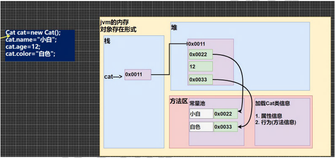
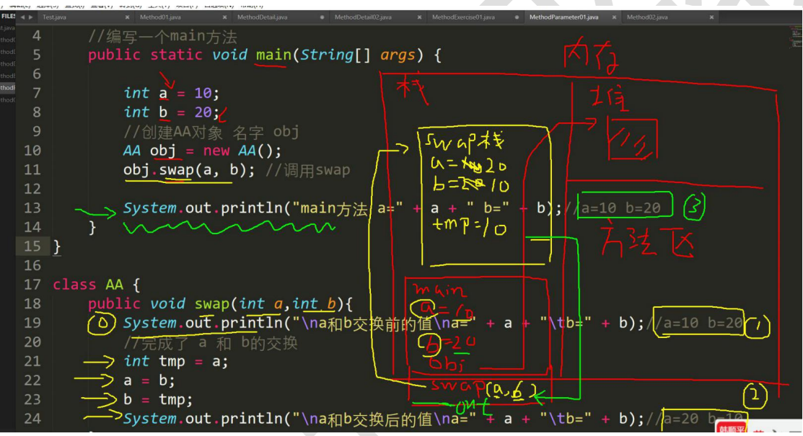

# 面向对象（基）

## 类与对象

>张老太养了两只猫猫:一只名字叫小白,今年 3 岁,白色。还有一只叫小花,今年 100 岁,花色。请编写一个程序，当用户 输入小猫的名字时，就显示该猫的名字，年龄，颜色。如果用户输入的小猫名错误，则显示 张老太没有这只猫猫

```java
public class Object {
  public static void main(String[] args) {
    //1.单独的定义遍历解决
    //2.使用数组解决
    //不利于数组的管理，效率低
    //单独变量来解决 => 不利于数据的管理
    //1.new Cat() 创建一只猫
    //2.Cat cat1 = new Cat();//把创建的猫赋给 cat1
    Cat cat1 = new Cat();
    cat1.name = "小白";
    cat1.age = 3;
    cat1.color = "白色";
    cat1.weight = 10;
    //创建第二只小猫
    Cat cat2 = new Cat();
    cat2.name = "小花";
    cat2.age = 10;
    cat2.color = "花色";
    cat2.weight = 8;
    //怎么访问对象的属性
    System.out.println(cat1.name + cat1.age + cat1.color + cat1.weight);//小白3白色10.0
    System.out.println(cat2.name + cat2.age + cat2.color + cat2.weight);//小花10花色8.0
  }
}

//定义一个猫类
class Cat {
  //属性
  String name;//名字
  int age;//年龄
  String color;//颜色
  double weight;//体重
}
```

**对象主要有属性和行为**

### 类和对象的区别和联系

1. 类是抽象的，概念的，代表一类事物，比如人类，猫类...即它是数据类型
2. 对象是具体的，实际的，代码一个具体事物，即 是实例
3. 类是对象的模板，对象是类的一个个体，对应一个实例

### 对象在内存中的形式

**字符串本质是引用类型**

字符串引用数据类型，年龄是基本数据类型



### 属性 / 成员变量 / 字段

#### 基本介绍

1. 从概念或叫法上；成员变量  = 属性 = field(字段)（即 成员变量是用来表示属性的）

   ```java
   public class Object02 {
     public static void main(String[] args){
       
     }
   }
   class Car{
     String name;//属性，成员变量，字段 field
     double price;
     String color;
     String[] master;//属性可以是基本数据变量，也可以是引用类型（对象，数组）
   }
   ```

2. 属性是类的一个组成部分，一般是基本数据类型，也可是引用类型（对象，数组）。比如前面定义的猫类的 int age 就是属性

### 注意事项和细节说明

1. 属性的定义语法同变量，实例：访问修饰符 属性类型 属性名；

   四种访问修饰符：**public，proctected，默认，private**

2. 属性的定义类型可以是任意类型，包含基本类型或引用类型

3. 属性如果不赋值，有默认值，规则和数组一致，具体说：**int 0，short 0，byte 0，long 0，float 0.0，double 0.0，char \u0000，boolean false，String null**

   ```java
   public class PropertiesDetail {
     public static void main(String[] args) {
       //创建 Person 对象
       //p1 是对象名（对象引用）
       //new Person（） 创建的对象空间（数据）才是真正的对象
       Person p1 = new Person();
       //对象的属性默认值，遵守数组规则
       //int 0，short 0，byte 0，long 0，
       //float 0.0，double 0.0，char \u0000，boolean false，String null
       System.out.println(p1.age + p1.name + p1.sal + p1.isPass);//0 null 0.0 false
     }
   }
   
   class Person {
     int age;
     String name;
     double sal;
     boolean isPass;
   }
   ```

### 创建对象

```java
//1.先声明再创建
	Cat cat;//先声明对象 cat
	cat = new Cat();//创建
//2.直接创建
	Cat cat = new Cat();
```

### 属性访问

```java
对象名.属性名
cat.name
cat.age
cat.color
```

### 类和对象的内存分配机制

**Java内存的结构分析**

1. 栈：一般存放基本数据类型（局部变量）

2. 堆：存放对象（Cat.cat，数组等）

3. 方法区：常量池（常量，比如字符串），类加载信息

4. 示意图

   ```java
   Person p = new Person();
   p.name = "jack";
   p.age = 10;
   //1.先加载 Person 类信息，（属性和方法信息，只会加载一次）
   //2.在堆中分配空间，进行默认初始化
   //3.先把地址赋给 p，p 就指向对象
   //4.进行指定初始化，比如 p.name ="jack"   p.age = 10;
   ```

   

## 成员方法

### 基本介绍

在某些情况下，需要定义**成员方法**（简称：方法）。比如人类：除了有一些属性外（年龄，姓名...），人类还有一些行为，比如：可以说话，跑步，通过学习可以做算术题，这时就要用**成员方法**才能完成，现在要求对 Person 类完善

```java
public class Method {
  public static void man(String[] args) {
    //1.添加 speak 成员方法，输出 身体健康
    //2.添加 cal01 成员方法，可以计算从 1++++1000 的结果
    //3.添加 cal02 成员方法，该方法可以接收一个数 n,计算从1+...+n 的结果
    //4.添加 getSum 成员方法，可以计算两个数的和
    Person p1 = new Person();
    p1.speak();//调用方法
    p1.cal01();//调用方法 cal01
    p1.cal02(10);//调用 cal02方法 n 为 10

    int returnRes = p1.getSum(10, 20);
    System.out.println("getSum返回值=" + returnRes);
  }
}

class Person {
  String name;
  int age;
  //方法（成员方法）
  //添加 speak 成员方法，输出 身体健康
  //1.public 表示方法公开
  //2.void 表示方法没有返回值
  //3.speak():speak 是方法名，（）形参列表
  //4.{} 方法体，可以写要执行的代码
  //5.System.out.println("身体健康")；表示方法是输出一句话
  public void speak() {
    System.out.println("身体健康");
  }

  //添加 cal01 成员方法，计算 1-1000相加的结果
  public void cal01() {
    int res = 0;
    for (int i = 0; i < 1000; i++) {
      res += i;
    }
    System.out.println("cal01=" + res);
  }

  //该方法可以接收一个数 n,计算从1+...+n 的结果
  public void cal02(int n) {
    int res = 0;
    for (int i = 0; i < n; i++) {
      res += i;
    }
    System.out.println("cal02=" + res);
  }

  //1.public 表示方法是公开的
  //2.int 表示方法执行后 返回一个 int 值
  //3.getSum 方法名
  //4.(int num1,int num2)形参，2个形参，可以接收用户传入的两个数
  //5.return res:表设把 res 的值返回
  public int getSum(int num1, int num2) {
    int res = num1 + num2;
    return res;
  }
}
```

### 方法的调用机制


### 成员方法的好处

1. 提高代码的复用性
2. 可以将实现的细节封装起来，然后供其他用户来调用即可

### 成员方法的定义

```java
访问修饰符 返回数据类型 方法名（形参列表...）{//方法体
    语句：
    	return 返回值;
}
```

1. 形参列表：表示成员方法输入 cal(int n)，getSum(int num1,int num2)
2. 返回数据类型，表示成员方法输出， void 表示没有返回值
3. 方法主体：表示为了实现某一功能代码块
4. return 语句不是必须的

### 注意事项和使用细节

```java
public class MethodDetail {
  public static void main(String[] args) {
    AA a = new AA();
    int[] res = a.getSumAndSub(1,4);
    System.out.println("和="+ res[0]);//5
    System.out.println("差="+ res[1]);//-3

    //细节：调用带参数的方法时，一定对应着参数列表传入相同类型或兼容类型 的参数
    byte b1 = 1;
    byte b2 = 2;

    a.getSumAndSub(b1,b2);//byte -> int
    //a.getSumAndSub(1.1,8.8); double>int

    //细节：实参和形参的类型要一致或兼容、个数、顺序必须一致
    //a.getSumAndSub(100); 参数个数不一致
    a.f3("tom",0);//ok
    //a.f3(100,"jack");//错误 实际参数和形式参数顺序不对
  }
}

class AA {
  //细节：方法不能嵌套定义
  public void f4() {
    //错误
/*    public void f5(){

    }*/
  }
  public void f3(String str, int n) {

  }
  //1.一个方法最多有一个返回值
  public int[] getSumAndSub(int n1, int n2) {
    int[] resArr = new int[2];
    resArr[0] = n1 + n2;
    resArr[1] = n1 - n2;
    return resArr;
  }
  //2.返回类型可以为任意类型，包含基本类型或引用类型（数组，对象）
  //3.如果方法要求有返回数据类型，则方法中最后的执行语句必须为 return 值；
  //而且要求返回值类型必须和 return 的值类型一致或兼容
  public double f1(){
    double d1 = 1.1 *3;
    int n = 100;
    return n;//int=> double
    //return d1;//ok double>int
  }
  //如果方法是 void,则方法体中可以没有 return 语句，或者 只写 return；
  public void f2(){
    System.out.println("hello1");
    int n = 10;
   
  }
}
```

**访问修饰符（作用是控制 方法的使用范围）**

如果你写默认访问：有**四种【public,protected,默认,private】**

### **返回数据类型**

1. 一个方法最多有一个返回值
2. 返回类型可以为任意类型，包含基本类型或引用类型（数组，对象）
3. 如果方法要求有返回数据类型，则方法体中最后的执行语句必须为 return 值；而且要求返回值类型必须和 return 的值类型一致或兼容
4. 如果方法是 void，则方法体中可以没有 return 语句，或者只写 return 

**方法名：遵循驼峰命名法**

### **形参列表**

1. 一个方法可以有 0 个参数，也可以有多个参数，中间用逗号隔开
2. 参数类型可以为任意类型，包含基本类型或引用类型
3. 调用带参数的方法时，一定对应着参数列表传入相同类型或兼容类型的参数
4. 方法定义时的参数称为形式参数，简称：形参，方法调用时的传入参数称为实际参数，简称：实参，实参和形参的类型要一致或兼容、个数、顺序必须一致

### 方法体

 里面写完成功的具体语句：可以为输入、输出、变量、运算、分支、循环、方法调用，但里面不能再定义方法！  即：方法不能嵌套定义

### **方法调用细节**

1. 同一个类中的方法调用：直接调用即可，比如：print(参数)
2. 跨类中的方法 A 类调用B 类方法：需要通过对象名调用：比如 对象名.方法名（参数）
3. 特别说明一下：跨类的方法调用和方法的访问修饰符相关

```java
public class MethodDetail {
  public static void main(String[] args){
    A a = new A();
    //a.sayOk();
    a.ml();
  }

}

class A{
  //同一个类中的方法调用，直接调用即可
  public void print(int n){
    System.out.println("print()方法被调用n=" + n);
  }
  public void sayOk(){//sayOk 调用 print
    print(10);
    System.out.println("继续执行sayOk()~~");
  }
  //跨类中的方法 A 类 调用 B 类方法，需要通过对象名调用

  public void ml(){
    //创建 B 对象，然后再调用方法即可
    System.out.println("ml(方法被调用)");
    B b = new B();
    b.hi();;
    System.out.println("ml() 继续执行");
  }
}

class B{
  public void hi(){
    System.out.println("B 类中的 hi()被执行");
  }
}
```

### 类定义的完善

```java
class 类名{				
    属性：
}
class 类名：{
    属性（成员变量）；
    成员方法；
}
```

```java
public class MethodDetail {
  public static void main(String[] args) {
    //1.编写类AA，有一个方法，判断一个数时奇数 odd 还是偶数，返回 boolean
    //2.根据行，列，字符打印 对应行数和列数的字符，比如 行4 列4

    AA a = new AA();
   /* if (a.isOdd(2)){//T , 这样的写法以后会看到很多
      System.out.println("奇数");
    }{
      System.out.println("偶数");
    }*/

    //使用 print 方法
    a.print(4,4,'#');
  }
}
//编写类AA 有一个方法，判断一个数时奇数 odd 还是偶数 返回 boolean

class AA {
  //1.方法的返回类型 boolean
  //2.方法的名字 isOdd
  //3.方法的形参（int num）
  //4.方法体 判断
  public boolean isOdd(int num) {
   /* if (num%2!=0){
      return true;
    }else {
      return false;
    }*/
    //return num %2!=0?true:false;
    return num % 2 != 0;
  }
    //根据行、列、字符打印 对应行数和列数的字符，
    //比如：行：4，列：4，字符#,则打印相应的效果
    /*
    ####
    ####
    ####
    ####
    */
    //思路
    //1. 方法的返回类型 void
    //2. 方法的名字 print
    //3. 方法的形参 (int row, int col, char c)
    //4. 方法体 , 循环
  public void print(int row, int col, char c) {
    for (int i = 0; i < row; i++) {
      for (int j = 0; j < col; j++) {//输出每一行
        System.out.print(c);
      }
      System.out.println(); //换行
    }
  }
}
```

## 成员方法传参机制

### 基本数据类型的传参机制

**基本数据类型，传递的是值（值拷贝），形参的任何改变不影响实参**

```java
public class MethodParameter {
  public static void main(String[] args){
    int a = 10;
    int b = 20;

    AA obj = new AA();
    obj.swap(a,b);
    System.out.println("main 方法 a=" + a + " b=" + b);//a=10 b=20
  }
}

class AA{
  public void swap(int a,int b){
    //在swap 栈中
    System.out.println("\na 和 b 交换前的值\na=" + a + "\tb=" + b);//a=10 b=20
    int tmp = a;
    a = b;
    b=tmp;
    System.out.println("\na 和 b 交换后的值\na=" + a + "\tb=" + b);//a=20 b=10
  }
}
```



### 引用数据类型的传参机制

**数组，对象 属于引用类型（引用类型会指向 堆）**

**引用类型传递的时地址（传递也是值，但是值是地址），可以通过形参影响实参**

```java
public class MethodParameter {
  public static void main(String[] args){
    //测试
    B b = new B();
    int[] arr = {1,2,3};
    b.test100(arr);//调用方法
    for (int i = 0; i < arr.length; i++) {
      System.out.print(arr[i] + "\t");//100 2 3
    }

  }
}
class B{
  //B类中编写一个方法 test100，可以接收一个数组，
  // 在方法中修改该数组，看看原来的数组是否变化，
  public void test100(int[] arr){
    arr[0]=100;
    for (int i = 0; i < arr.length; i++) {
      System.out.print(arr[i]+"\t");//100 2 3
    }
  }
}
```


```java


public class MethodParameter {
  public static void main(String[] args){
    //B类中编写一个方法 test200，可以接收一个Person(age,sal)对象，
    // 在方法中修改该对象属性，看看原来的对象是否变化
    B b = new B();
    Person p = new Person();
    p.name =  "jack";
    p.age=10;
    b.test200(p);
//    System.out.println(p.age+p.name);//1000 tom
    System.out.println(p.age+p.name);//10 jack
  }
}
class Person{
  int age;
  String name;
}
class B{
  public void test200(Person p){
/*    p.age = 1000;
    p.name="tom";*/
    p=null;
  }
}
```


### 思考：

**p=null 和 p = new Person();对应示意图**

**p = null 是 test200 堆中 p 设置为 null，不是引用地址 设置为 null**

**p = new Person();p.name = "tom";p.age = 99;打印：p.age = 10;**


### 成员方法返回类型是引用类型应用实例

```java
public class MethodExercise {
  public static void main(String[] args){
    Person p = new Person();
    p.name = "milan";
    p.age=100;

    //创建tools
    MyTools tools = new MyTools();
    Person p2 = tools.copyPerson(p);

    //到此 p 和 p2 是Person对象，但是是两个独立的对象，属性相同
    System.out.println("p 的属性age="+p.age + "名字=" + p.name);//100 milan
    System.out.println("p2 的属性age="+p2.age + "名字=" + p2.name);//100 milan
    System.out.println(p==p2);//false
  }
}

class Person{
  String name;
  int age;
}
class MyTools{
  //编写一个方法 copyPerson 可以复制一个Person对象，放回复制的对象，克隆对象
  //注意：要求得到新对象和原来的对象是两个独立的对象，只是他们的属性相同
  //编写方法思路
  //1.方法的返回类型 Person
  //2.方法的名字 copyPerson
  //3.方法的形参 （Person P）
  //4.方法体，创建一个新对象，并复制属性，返回即可
  public Person copyPerson(Person p){
    //创建一个新的对象
    Person p2 = new Person();
    p2.name = p.name;//把原来的名字赋给 p2.name
    p2.age=p.age;//把原来对象的年龄赋给 p2.age
    return p2;
  }
}
```


## 方法递归调用

### 基本介绍

描述：**递归就是方法自己调用自己**，每次调用时传入不同的变量，递归有助于编程者解决复杂问题，同时可以让代码变得简洁

```java
/递归能解决什么问题
1.各种数学问题：8皇后问题，汉诺诺，阶乘问题，迷宫问题，球和篮子的问题（google编程大赛）
2.各种算法中也会使用到递归，比如快排，归并排序，二分查找，分治算法等
3.将用栈解决的问题===>递归代码比较简洁
```

### 递归举例

```java
public class Recursion {
  public static void main(String[] args) {
    T t1 = new T();
    t1.test(4);// 4 3 2
    int res = t1.factorial(5);
    System.out.println(res);//5 * 4 * 3 * 2 * 1 = 120
  }
}

class T {
  public void test(int n) {
    if (n > 2) {
      test(n - 1);
    }
    System.out.println("n=" + n);
  }
  //factorial 阶乘
  public int factorial(int n) {
    if (n == 1) {
      return 1;
    } else {
      return factorial(n - 1) * n;
    }
  }
}
```


### 递归重要规则

1. 执行一个方法时，就创建一个新的受保护的独立空间（栈空间）
2. 方法的局部变量是独立的，不会相互影响，比如 n 变量
3. 如果方法中使用的是引用类型变量（比如：数组，对象），就会共享该引用类型的数据
4. 递归必须向退出递归的条件逼近，否则就是无限递归，出现 StackOverflowError 
5. 当一个方法执行完毕，或者遇到 return，就会返回，遵守谁调用，就将结果返回给谁，同时当方法执行完毕或者返回时，该方法也就执行完毕

**练习**

```java
public class RecursionExercise {
  public static void main(String[] args) {

    T t1 = new T();
     /*int n = 7;
    int res = t1.fibonacci(n);
    if (res != -1) {
      System.out.println("当n=" + n + "对应的斐波那契数=" + res);//7 13
    }*/

    //桃子问题
    int day = 1;
    int peachNum =t1.peach(day);
    if (peachNum!=-1){
      System.out.println("第"+day+"天有"+peachNum+"个桃子");//1534
    }

  }
}

class T {
  //使用递归的方法求出斐波那契数 1,1,2,3,5,8,13...给你一个整数 n ,求出它的值是多少
  //1.当 n = 1 斐波那契数 1
  //2.当 n = 2 斐波那契数 1
  //3.当 n >=3 斐波那契数  是前两个数的和
  //4.这里就是一个递归思路
  public int fibonacci(int n) {
    if (n >= 1) {
      if (n == 1 || n == 2) {
        return 1;
      } else {
        return fibonacci(n - 1) + fibonacci(n - 2);
      }
    } else {
      System.out.println("要求输入的 n>=1 的整数");
      return -1;
    }
  }
  /*
   * 猴子吃桃问题：有一堆桃子，猴子第一天吃了其中的一半，并在再多吃了一个
   * 以后每天猴子都吃其中的一半，然后再多吃一个，当道第十天时，
   * 想再吃时（即还没吃）发现只有一个桃子了，最初共多少桃子
   * */
  //1.day = 10 时，有 1 个桃子
  //2.day = 9 时，有（day10 + 1）*2  = 4
  //3.day = 8 时，有（day9+1）*2 = 10;
  //规律，前一天的  = （后一天的 + 1）*2
  //递归
  public int peach(int day) {
    if (day == 10) {//第十天只有一个桃子
      return 1;
    } else if (day >= 1 && day <= 9) {
      return (peach(day + 1) + 1) * 2;
    } else {
      return -1;
    }
  }
}
```

### 递归实例-迷宫问题
