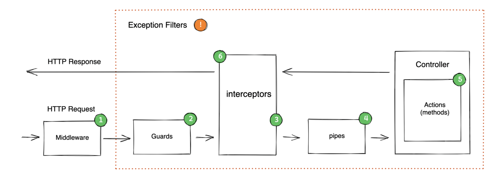

# 基础知识

[Nest.js](https://docs.nestjs.com/) 用于构建高效且可伸缩的服务端应用程序的渐进式 Node.js 框架

一个请求流经**中间件**、**守卫与拦截器**，然后到达管道，并最终回到拦截器中的返回路径中（从而产生响应）

## 项目创建

### 构建工具

- 可以使用 npm 、yarm、pnpm 进行包管理
- 建议安装 nrm 镜像源管理工具，方便切换国内镜像，提供下载速度
- 建议安装 nvm 用于管理 node 版本

全局命令

```ts
pnpm add -g @nestjs/cli nodemoin ts-node   (pnpm i -g @nestjs/cli)
nest new project-name
```

### 项目依赖

进入项目目录然后安装项目依赖，包含prisma、表单验证、加密工具、JWT、文件上传、工具包、日期处理等

```ts
pnpm add prisma-binding ts-node @prisma/client mockjs @nestjs/config class-validator class-transformer argon2 @nestjs/passport passport passport-local @nestjs/jwt passport-jwt lodash multer dayjs express redis @nestjs/throttler mockjs @nestjs/cache-manager cache-manager md5 @casl/prisma @casl/ability

pnpm add -D prisma typescript @types/node @types/mockjs @nestjs/mapped-types @types/passport-local @types/passport-jwt @types/express @types/lodash @types/multer @types/cache-manager @types/md5
```

注意事项：

- <b>ts-node 要安装在 dependencies</b>

### prettierrc

NestJs项目创建后会生成 `.prettierrc`文件，这是代码格式化规范

| 名称                       | 选项                                                         |
| -------------------------- | ------------------------------------------------------------ |
| arrowParens                | avoid：(默认，尽可能省略 parens) <br />always：始终包括 parens |
| bracketSameLine            | 默认 false，将 > 多行 html(html、JSX、Vue、Angular)元素放在最后一行末尾，而不是单独放在下一行 |
| bracketSpacing             | 默认 true 是否在对象的中括号之间添加空格                     |
| embeddedLanguageFormatting | 默认 auto：如果 Prettier 可以自动识别，则格式化嵌入代码，off:从不自动格式化嵌入代码 |
| htmlWhitespaceSensitivity  | css：遵守 CSS disable 属性的默认值<br />strict：空格被认为是敏感的<br />ignore：空格被认为是不敏感的<br />指定 HTML、Vue、Angular 和 Hanlebars 的全家空白敏感度 |
| insertPragma               | 默认 false,                                                  |
| jsxSingleQuote             | 默认 false，在 JSX 中使用单引号而不是双引号                  |
| printWidth                 | always：如果散文超出打印宽度，则换行<br />never：将每一段散文合并成一行<br />preserve(默认)：什么都不做，让散文保持原样 |
| proseWrap                  | always：如果散文超出打印宽度，则换行<br />never：将每一段散文合并成一行<br />preserve(默认)：什么都不做，让散文保持原样 |
| quoteProps                 | as-needed(默认)：仅在需要时再对象属性范围添加引号<br />consistnet：如果对象中至少有一个属性需要引号，则引用所有属性<br />preserve：尊重对象属性中引号的输入用法 |
| requirePragma              | 默认 false，可以指定需要指定格式化的文件，当设置为 true，只有文件顶部包含了以下注释的文件才会被格式化 |
| semi                       | 控制语句末尾是否使用分号。设置为 `true` 则使用分号，`false` 则不使用 |
| singleQuote                | 使用单引号而不是双引号。设置为 `true` 则使用单引号，`false` 则使用双引号 |
| tabWidth                   | 缩进每个级别使用的空格数。例如，设置为 `2` 表示使用两个空格进行缩进 |
| trailingComma              | 控制是否在多行语句的末尾添加逗号。选项有 `"none"`（无尾随逗号）、`"es5"`（仅在 ES5 中有效的尾随逗号）、`"all"`（尽可能多地使用尾随逗号） |
| useTabs                    | 使用制表符而不是空格进行缩进。设置为 `true` 则使用制表符，`false` 则使用空格。通常与 `tabWidth` 结合使用来定义缩进风格 |
| vueIndentScriptAndStyle    | 默认 false，是否对 Vue 文件里 script 和 style块中的代码进行缩进，缩进值为 tabWidth |
| singleAttributePerLine     | 默认 false，再 HTML、Vue、JSX中是否强制限制每行只有一个属性  |

```ts
{
  "arrowParens": "always",
  "bracketSameLine": true,
  "bracketSpacing": true,
  "embeddedLanguageFormatting": "auto",
  "htmlWhitespaceSensitivity": "css",
  "insertPragma": false,
  "jsxSingleQuote": false,
  "printWidth": 120,
  "proseWrap": "never",
  "quoteProps": "as-needed",
  "requirePragma": false,
  "semi": false,
  "singleQuote": true,
  "tabWidth": 2,
  "trailingComma": "all",
  "useTabs": false,
  "vueIndentScriptAndStyle": false,
  "singleAttributePerLine": false
}
```

## 依赖注入

依赖注入指创建对象的过程由框架自动完成，a 对象再使用 b 对象，b 对象使用 c 对象，a 对象只需要使用 b 对象，而不需要了解 b 对象怎么样创建出 c 对象

### 高耦合代码

以下代码是没有依赖注入的情况，a 对象要考虑 b 对象的参数，如果 c 对象也有参数也要考虑，这显然是高耦合低效率的编码体验

```ts
class c{
    run(){
        console.log("c object");
    }
}

class b{
    constructor(private c){}
    run(){
        this.c.run();
    }
}

class a{
    constructor(private b){}
    
    run(){
        this.b.run();
    }
}

const web = new a(new a(new c()));
web.run();
```

### 依赖注入

NestJs 将类定义在模块的 **providers** 属性中即声明为提供者，其他类型可以在 **constructor** 构造函数中依赖注入，实现编码的解耦

下面代码的构造函数使用依赖注入 PrismaService 与 JwtService 服务实例

```ts
@Injectable()
export class AuthService {
  constructor(private readonly prismaService: PrismaService, private readonly jwtService: JwtService) {}

  async login(loginDto: LoginDto) {
    const user = await this.prismaService.user.findUnique({
      where: {
        name: loginDto.name,
      },
    })

    const passwordCheck = await argon2.verify(user.password, loginDto.password)
    if (!passwordCheck) throw new BadRequestException('密码输入错误')

    return this.token(user)
  }
  ...
}
```

## 生命周期



nest.js请求生命周期大致如下

1. 收到请求
2. 全局绑定的中间件
3. 模块绑定的中间件
4. 全局守卫
5. 控制层守卫
6. 路由守卫
7. 全局拦截器（控制器之前）
8. 控制器层拦截器（控制器之前）
9. 路由拦截器（控制器之前）
10. 全局管道
11. 控制器管道
12. 路由管道
13. 路由参数管道
14. 控制器（方法处理器）
15. 路由拦截器（请求之后）
16. 控制器拦截器（请求之后）
17. 全局拦截器（请求之后）
18. 异常过滤器（路由，之后是控制器，之后是全局）
19. 服务器响应

## 命令介绍

| name          | alias       | description                  |
| ------------- | ----------- | ---------------------------- |
| application   | application | 生成新的应用程序工作区       |
| class         | cl          | 生成新类                     |
| configuration | config      | 生成 CLI 配置文件            |
| controller    | co          | 生成控制器声明               |
| decorator     | d           | 生成自定义装饰器             |
| filter        | f           | 生成过滤器声明               |
| gateway       | ga          | 生成网关声明                 |
| guard         | gu          | 生成 guard 声明              |
| interceptor   | itc         | 生成拦截器声明               |
| interface     | itf         | 生成接口                     |
| library       | lib         | 在 monorepo 中生成新库       |
| middleware    | mi          | 生成中间件声明               |
| module        | mo          | 生成模块声明                 |
| pipe          | pi          | 生成管道声明                 |
| provider      | pr          | 生成提供程序声明             |
| resolver      | r           | 生成 GraphQL 解析程序声明    |
| resource      | res         | 生成新的 CRUD 资源           |
| service       | s           | 生成服务声明                 |
| sub-app       | app         | 在 monorepo 中生成新应用程序 |

**nest g s -h**介绍

| -d, --dry-run                     | 报告将在不写出结果的情况下执行的作   |
| --------------------------------- | ------------------------------------ |
| -p, --project [project]           | 要在其中生成文件的项目               |
| --flat                            | 强制生成元素的平面结构               |
| --no-flat                         | 强制生成目录                         |
| --spec                            | 强制生成 spec 文件。（默认值：true） |
| --spec-file-suffix [suffix]       | 对 spec 文件使用自定义后缀           |
| --skip-import                     | 跳过导入 （默认： false）            |
| --no-spec                         | 禁用 spec 文件生成.                  |
| -c, --collection [collectionName] | 要使用的 Schematics 集合             |
| -h, --help                        | 输出使用信息                         |
