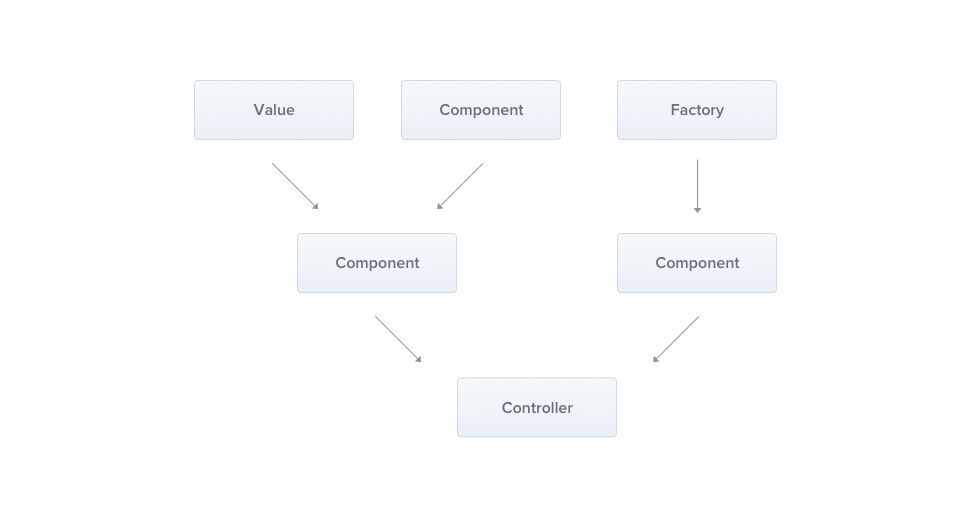

# 提供者

**Providers** 是 `Nest` 的一个基本概念，许多基本的 `Nest` 类都可能被视为 `provider-service`，`reposition`，`factory`，`helper`等等。都是通过 `constructor` **注入**依赖关系。这意味这对象可以彼此创建各种关系，并且“连接”对象实例的功能在很大成都上可以委托给 `Nest`运行时系统

Provider只是一个用 **@Injectable()** 装饰器注释的类



在模块中使用 **providers** 声明提供者，提供者需要被注册到模块的服务器中，才可被依赖注入

- 提供者使用 **@Injectable()** 装饰器定义，这样系统分析 **constructor** 进行依赖注入
- 提供者在模块的 **providers** 属性中定义，用于注册到服务器中，用于被其他类依赖注入
- 提供者可以在自身的 **constructor** 构造函数中依赖注入其他服务提供者，需要使用 **@Inhectable()** 装饰器声明该提供者
- 注册到容器的提供者，默认只对当前模块有效，即作用域为模块
- 可以使用 **export** 导出给其他模块使用
- 提供者是单例的
- 提供者可以是任何值，而不仅仅是服务类

提供者在模块的 **Providers** 属性中声明，可以将提供者注册到容器的方法中去

## 基本数据

可以将普通数据使用 `useValue`注册到服务容器

```ts
@Module({
    providers:[{
        provide:"APP_NAME",
        useValue:"nestjs笔记"
    }]
})

 providers: [
    AppService,
    {
      provide:HdService,
      useClass: HdService,
    }
  ],
```

**因为普通数据服务不是 class，所以要使用 @Inject 进行注入**

```ts
@Injectable()
export class AuthService{
    constructor(
    	@Inject("APP_NAME")
         private appName
    ){}
    show(){
        return this.appName
    }
}
```

## 类注册

使用类将提供者注册到服务容器中是最常用的方式

### 基本使用

常用的使用类将提供者注册到容器的方式

```ts
@module({
    providers:[authService]
})
```

完整写法如下

```ts
@module({
    providers:[{
        provider:AuthService,
        useClass:AuthService,
    }]
})
```

## 动态注册

实现根据不同的环境创建不同的服务，首先安装 **dotenv** 扩张包，用来读取 **.env**环境变量

```ts
pnpm add dotenv
```

然后创建两个服务 **app.service.ts 与 dev.service.ts**

**appService.ts内容**

```ts
import {Injectable} from "@nestjs/common";

@Injectable()
export class AppService {
  get(): string {
    return "appService get methods";
  }
}
```

**dev.Service.ts内容**

```ts
import { Injectable } from "@/nestjs/common";

@Injectable()
export class DevService{
    get(){
        return "devService get mrthods";
    }
}
```

**app.module.ts**内容

```ts
import {Module} from "@nestjs/common";
import {AppController} from "./app.controller";
import {AppService} from "./app.service";
import {DevService} from './dev.service';
import {config} from "dotenv";
import * as path from "node:path";
import * as process from "node:process";

config({path: path.join(__dirname, '../.env')});

console.log(process.env.NODE_ENV);

const configService = {
  provide: 'configService',
  useClass: process.env.NODE_ENV ==='development'? DevService : AppService,
}


@Module({
  imports: [],
  controllers: [AppController],
  providers: [
    configService,
  ],
})

export class AppModule {
}
```

### 动态加载配置项

**dev.service.ts**

```ts
import {Inject, Injectable} from '@nestjs/common';
import {ConfigType} from "./types/config";

@Injectable()
export class DevService {
  constructor(@Inject("Config") private Config:ConfigType) {
  }
  get(){
    return "DevService get method"+`[${this.Config.url}]`;
  }
}
```

**app.service.ts**

```ts
import {Inject, Injectable} from '@nestjs/common';
import {ConfigType} from "./types/config";

@Injectable()
export class AppService {
  constructor(@Inject("Config") private Config:ConfigType) {
  }
  get(){
    return "appService get method" + `[${this.Config.url}]`;
  }
}
```

**app.controller.ts**

```ts
import {Controller, Get, Inject} from '@nestjs/common';

@Controller()
export class AppController {
  constructor(@Inject('configService') private appService) {
  }
  
  @Get()
  getHello(): string {
    return this.appService.get();
  }
}
```

**config.service.ts**

```ts

import {config} from 'dotenv';
import * as path from "node:path";
import * as process from "node:process";
import {developmentConfig} from "./config/development.config";
import {productionConfig} from "./config/production.config";

config({path: path.join(__dirname, './../.env')});

export const Config = {
  provide: "Config",
  useValue: process.env.NODE_ENV === "development" ? developmentConfig : productionConfig,
}
```

**app.module.ts**

```ts
import {Module} from "@nestjs/common";
import {AppController} from "./app.controller";
import {AppService} from "./app.service";
import {DevService} from './dev.service';
import {config} from "dotenv";
import * as path from "node:path";
import * as process from "node:process";
import {Config} from "./config.service";

config({path: path.join(__dirname, '../.env')});

console.log(process.env.NODE_ENV);

const configService = {
  provide: 'configService',
  useClass: process.env.NODE_ENV ==='development'? DevService : AppService,
}


@Module({
  imports: [],
  controllers: [AppController],
  providers: [
    configService,Config
  ],
})

export class AppModule {
}
```

## 工厂函数

针对于复杂要求的**provider** ，我们可以使用 **useFactory** 工厂函数对提供者进行注册。

### 基本使用

下面使用工厂函数注册基本数据

```js
import { Module } from '@nestjs/common'
import { AuthController } from './auth.controller'
import { AuthService } from './auth.service'

class XjClass {
  make() {
    return 'this is XjClass Make Method'
  }
}
@Module({
  providers: [
    AuthService,
    XjClass,
    {
      provide: 'HD',
      //依赖注入其他提供者,将做为参数传递给 useFactory 方法
      inject: [XjClass],
      useFactory: (xjClass) => {
        return xjClass.make()
      },
    },
  ],
  controllers: [AuthController],
})
export class AuthModule {}
```

在其他服务中使用定义的HD提供者

```js
@Injectable()
export class AuthService {
  constructor(
    @Inject('HD')
    private hd
  ) {}
  show() {
    return this.hd
  }
  ...
}
```

### 动态配置

下面使用工厂函数实现根据.env 环境变量值，加载不同配置项。

首先创建`config/development.config.ts` 与`config/production.config.ts` 配置文件

`development.config.ts`

```js
export const devConfig = {
  url: 'localhost',
};
```

`production.config.ts`

```js
export const productionConfig = {
  url: 'houdunren.com',
};
```

<strong>然后在模块中使用 useFactory 动态注册配置</strong>

```js
import { Module } from '@nestjs/common';
import { config } from 'dotenv';
import path from 'path';
import { AppController } from './app.controller';
import { devConfig } from './config/development.config';
import { productionConfig } from './config/production.config';
config({ path: path.join(__dirname, '../.env') });

const configService = {
  provide: 'config',
  useFactory() {
    return process.env.NODE_ENV === 'development'
      ? devConfig
      : productionConfig;
  },
};
@Module({
  imports: [],
  controllers: [AppController],
  providers: [appService, configService],
})
export class AppModule {}
```

## 服务导出

默认情况下服务只在当前模块有效，如果服务要供其他模块使用，需要在该服务所在模块的 **exports** 属性中声明导出。

### 导出服务

下例是将 xj.module.ts 模块的服务 XjService 导出给其他模块使用。

```js
import { Module } from '@nestjs/common';
import { XjService } from './xj.service';
import { XjController } from './xj.controller';

@Module({
  providers: [XjService],
  controllers: [XjController],
  exports: [XjService],
})
export class XjModule {}
```

### 导入服务

其他模块需要**imports**导入该模块后,才可以使用该模块导出的服务，下面是 HdModule 模块使用 XjModule 的 XjService 服务的定义。

```js
import { XjModule } from './../xj/xj.module';
import { Module } from '@nestjs/common';
import { HdController } from './hd.controller';
import { HdService } from './hd.service';

@Module({
  imports: [XjModule],
  controllers: [HdController],
  providers: [HdService],
})
export class HdModule {}
```

## 异步提供者

我们也可以注册异步提供者，用于对异步业务的处理。

### 声明导出

下面在 **HdModule** 模块中定义异步提供者 **XjAsyncService**

```js
import { Module } from '@nestjs/common';
import { HdController } from './hd.controller';
import { HdService } from './hd.service';

@Module({
  imports: [],
  controllers: [HdController],
  providers: [
    HdService,
    {
      provide: 'HdAsyncService',
      useFactory: async () => {
        return new Promise((r) => {
          setTimeout(() => {
            r('向军大叔');
          }, 3000);
        });
      },
    },
  ],
  exports: [HdService, 'HdAsyncService'],
})
export class HdModule {}
```

### 使用提供者

然后在 **XjModule** 中使用 **HdModule** 模块导出的 **HdAsyncService**

```js
import { Module } from '@nestjs/common';
import { HdModule } from './../hd/hd.module';
import { XjController } from './xj.controller';
import { XjService } from './xj.service';

@Module({
  imports: [HdModule],
  providers: [XjService],
  controllers: [XjController],
  exports: [XjService],
})
export class XjModule {}
```

现在就可以在 **XjModule** 模块的控制器中使用 HdAsyncService 服务了

```js
import { Controller, Get, Inject } from '@nestjs/common';

@Controller('xj')
export class XjController {
  constructor(
    @Inject('XjAsyncService')
    private readonly xjAsyncService: string,
  ) {}
  @Get()
  show() {
    return this.xjAsyncService;
  }
}
```
