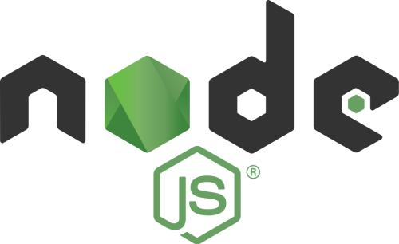

# Npm

## 安装配置



NPM是随同NodeJS一起安装的包管理工具，是常用的前端包管理工作

访问 [nodejs (opens new window)](https://nodejs.org/zh-cn/)官网下载安装 nodejs , 其中将内置npm命令

## 版本号

在安装时版本号是很关键的，大家要清楚版本更新规则

### 版本号说明

版本示例: **a.b.c** 表示 **主版本号.次版本号.修补版本号**

- a 兼容版本，一般来讲版本`2.0.0`不一定向`1.0.0`兼容，所以这个版本号更新要慎重
- b 次版本号，一般为功能上的升级
- c 修订号，一般指对程序`bug`的修复

### 指定版本

可以通过`^ 、~ 、*`来指定版本号

- `^`表示与版本兼容，指从最左边非0算起，该数值不能变
  1. 版本号`^2.1.0`：指`>= 2.1.0`但`< 3.0.0`
  2. 版本号`^0.2.1`：指`>= 0.2.1`但`< 0.3.0`
  3. 版本号`^0.1.0`：指`>= 0.1.0`但`< 0.2.0`
- `~`表示次版本号的更新规则，指从最右边非 0 算起，该数值不能变
  1. `~2.1.0`：指`>=2.1.0`但`<2.2.0`
  2. `~2.2.0`：指`>=2.0.0`但`=2.0.0`因为次版本号为0
- `*`表示任意版本，永远更新最新版本
- `-`表示版本区间
  - `1.2.1-1.6.5`：指 `1.2.1与1.6.5`间的任意版本

### 锁定版本

每次更新版本后会生成yarn.lock文件，用于记录当前项目的使用的软件版本号，这样别人执行 `yarn`安装包时与项目开发者使用的是相同版本，来保证程序的稳定运行

## 常用命令

### 安装软件

**全局安装**

```text
npm install -g <Module Name>
```

安装软件包，但不修改package.json 文件，以后使用npm install 时不会自动安装

```text
npm install <Module Name>
```

**生产环境**

- 在`package.json`文件`dependencies`属性下增加记录
- `npm install`是会自动安装该软件包
- 使用`npm install --production`或者`NODE_ENV`变量值为`production`时，安装该软件包

```js
npm install --save <module name>

//简写
npm install -S
```

**开发环境**

- 在package.json文件devDependencies属性下增加记录
- npm install 时会自动安装该软件包
- 使用npm install --production或者NODE_ENV变量值为production时，不会安装该软件包

```js
npm install --save-dev <Module Name>
    
//简写
npm install -D
```

### 查看软件

查看安装的模块列表

```text
npm ls
```

查看本地已安装的包信息

```text
npm ls tailwindcss
或
npm ls | grep tailwind
```

查看包信息

```text
npm info tailwindcss
或
npm view tailwindcss
```

列出项目的依赖

```text
npm list
```

列出项目的依赖，并限制显示的依赖深度

```text
npm list --depth=2
```

### 更新软件

更新npm自身

```text
npm install npm -g
```

更新所有软件包

```text
npm update
```

更新指定软件包

```text
npm update <Module Name>
```

### 卸载软件

删除全局软件

```text
npm uninstall -g <Module Name>
```

删除项目中软件包

```text
npm uninstall <Module Name>
```

### npx

node安装后会提供npx命令，使用npx命令可以直接调用模块命令。

下面是不使用npx调用mockjs中的random命令方式

```text
node_modules/mockjs/bin/random
```

使用npx可以简化调用，他会在`node_modules/.bin` 目录和环境变量`$PATH`中查找命令并执行

```text
npx random
```